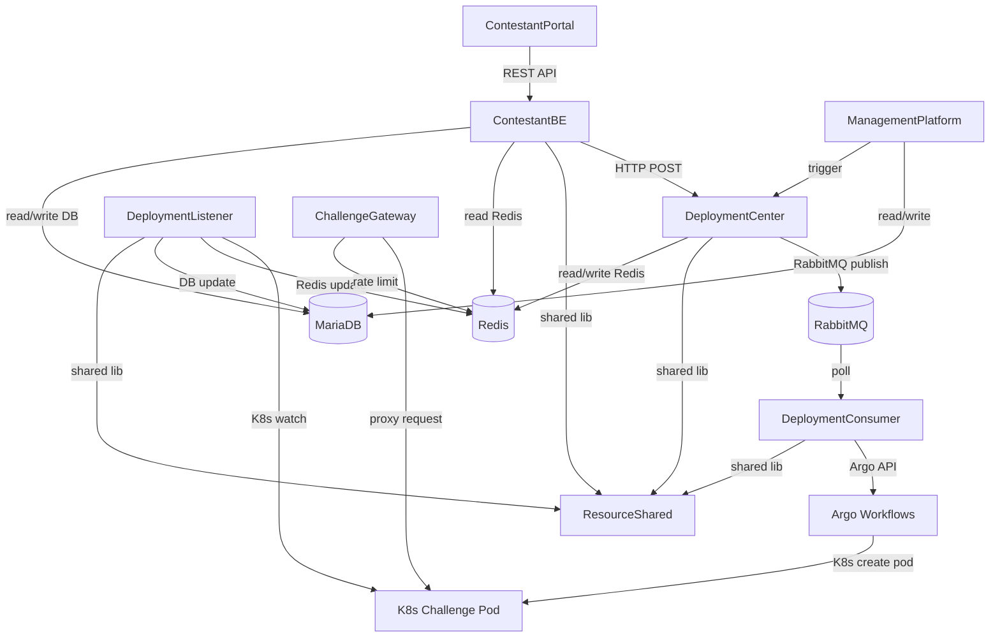

# FCTF-Multiple_Contest — Phân Tích Chi Tiết Nhiệm Vụ & Chức Năng Từng Folder

> **Ngày phân tích:** 19/04/2026
> **Version:** FCTF-Multiple_Contest
> **Người phân tích:** Antigravity AI (Claude Sonnet 4.6 Thinking)
> **Ghi chú:** Đây là nhánh phát triển Multi-Contest từ FCTF-temp-v5. Codebase kế thừa toàn bộ v5 và đang bổ sung hỗ trợ đa cuộc thi.

---

## Tổng Quan Cấu Trúc Thư Mục Gốc

```
FCTF-Multiple_Contest/
├── ChallengeGateway/                          ← Cổng vào challenge (Go)
├── ContestantPortal/                          ← Frontend SPA (React + TypeScript)
├── ControlCenterAndChallengeHostingServer/    ← .NET Solution (5 projects)
│   ├── ContestantBE/                          ← Backend chính cho thí sinh
│   ├── DeploymentCenter/                      ← Điều phối deploy challenge
│   ├── DeploymentConsumer/                    ← Background worker xử lý queue
│   ├── DeploymentListener/                    ← K8s watcher / event listener
│   └── ResourceShared/                        ← Thư viện dùng chung
├── Documentation/                             ← Tài liệu hệ thống
├── FCTF-ManagementPlatform/                   ← Admin portal (Python/CTFd fork)
├── FCTF-k3s-manifest/                         ← Kubernetes manifests (production)
├── Test/                                      ← Test suite (Gateway, stress, race)
├── database-migration/                        ← Tool migrate dữ liệu từ CTFd sang FCTF
├── manage.sh                                  ← Script quản lý hệ thống production
├── ARGO_SCALABILITY_ANALYSIS.md              ← Phân tích scalability Argo
├── FCTF_ARCHITECTURE_ANALYSIS.md             ← Tài liệu phân tích kiến trúc
├── FCTF_FOLDER_ANALYSIS.md                   ← Phân tích cấu trúc folder (file này)
├── FCTF_MULTI_CONTEST.md                     ← Danh sách thay đổi Multi-Contest
├── FCTF_START_CHALLENGE_BE_ANALYSIS.md       ← Phân tích luồng Start Challenge
├── MULTI_CONTEST_APPROACH_B_DETAIL.md        ← Chi tiết Approach B (per-schema)
├── MULTI_CONTEST_ROADMAP.md                  ← Roadmap triển khai Multi-Contest
├── TECH_CSHARP_DOTNET.md                     ← Tài liệu kỹ thuật C#/.NET
├── TECH_PYTHON_FLASK.md                      ← Tài liệu kỹ thuật Python/Flask
├── phan_tich_luong_chinh.md                  ← Phân tích luồng chính (tiếng Việt)
└── phan_tich_luong_up_va_start_challenge.md  ← Phân tích luồng Upload & Start
```

---

## 1. `ChallengeGateway/` — Cổng Truy Cập Challenge

### Vai trò trong hệ thống
Đây là **điểm vào duy nhất** để thí sinh truy cập vào các challenge pod đang chạy trên Kubernetes. Viết bằng **Go (Golang)** vì yêu cầu hiệu năng cao, xử lý hàng ngàn kết nối đồng thời.

### Chức năng chính
| Chức năng | Mô tả |
|---|---|
| **HTTP Reverse Proxy** | Forward HTTP request từ thí sinh vào Challenge Pod đúng team |
| **TCP Proxy** | Tunnel kết nối netcat/pwntool vào Challenge Pod (pwn, rev challenges) |
| **JWT Authentication** | Verify token `fctftoken` (ký HMAC) trước khi cho phép truy cập |
| **Rate Limiting** | Giới hạn request/s theo (token, IP) để chống spam/DoS |
| **Cookie Management** | Chuyển đổi token từ URL query string sang HttpOnly cookie |
| **Route Expansion** | Giải mã JWT payload để lấy địa chỉ K8s pod (host:port) |

### Cấu trúc thư mục
```
ChallengeGateway/
├── main.go                 ← Entry point: khởi động HTTP + TCP server
├── go.mod / go.sum         ← Go module dependencies
├── Dockerfile              ← Build image production
├── .env.example            ← Mẫu cấu hình biến môi trường
└── internal/
    ├── config/             ← Load cấu hình từ env (JWT secret, ports, Redis URL...)
    ├── gateway/
    │   ├── http.go         ← HTTP proxy handler: cookie auth, rate limit, reverse proxy
    │   ├── tcp.go          ← TCP proxy handler: token prompt, bidirectional copy
    │   └── util.go         ← Hàm tiện ích dùng chung (token parsing, route expand)
    ├── limiter/            ← Redis-backed rate limiter (per IP, per token)
    └── token/              ← JWT verification logic (HMAC-SHA256)
```

### Luồng xử lý HTTP
```
Thí sinh → GET https://gateway/?fctftoken=<jwt>
    ↓ Verify JWT (HMAC) + Rate limit IP
    ↓ Set cookie FCTF_Auth_Token (HttpOnly)
    ↓ Redirect về URL sạch
    ↓ Lần sau: đọc cookie → verify → ExpandRoute → Reverse Proxy → Pod
```

### Luồng xử lý TCP
```
nc gateway 1337
    ↓ Check IP rate limit + connection count
    ↓ Prompt "Please enter your token:"
    ↓ Đọc token từ stdin → Verify JWT
    ↓ Dial TCP tới Pod IP:port
    ↓ Bidirectional copy (client ↔ pod) cho đến khi token hết hạn
```

### Điểm đặc biệt
- Khi token hết hạn (`exp`), kết nối TCP bị **tự động ngắt** bằng expiry timer.
- JWT payload chứa `route` (địa chỉ pod) và `exp` (thời gian hết hạn) — hoàn toàn stateless, không cần tra Redis để biết pod ở đâu.
- Ghi log chi tiết mọi kết nối: `team_id`, `challenge_id`, `namespace`, `method`, `status`.

---

## 2. `ContestantPortal/` — Frontend SPA Cho Thí Sinh

### Vai trò trong hệ thống
Là **giao diện người dùng** duy nhất cho thí sinh thi đấu. Thí sinh dùng trình duyệt để xem challenge, start/stop instance, nộp flag, xem bảng điểm, tạo ticket hỗ trợ.

### Công nghệ
- **React 18 + TypeScript** — kiến trúc component-based
- **Vite** — build tool hiệu năng cao
- **Tailwind CSS** — utility-first styling
- **Port:** 3000 (dev)

### Cấu trúc thư mục
```
ContestantPortal/
├── index.html              ← HTML entry point
├── package.json            ← NPM dependencies + scripts
├── vite.config.ts          ← Vite build configuration
├── tailwind.config.js      ← Tailwind CSS configuration
├── tsconfig.json           ← TypeScript config
├── types/                  ← Global TypeScript type declarations
├── docker/                 ← Docker config cho production build
└── src/
    ├── main.tsx            ← App entry point (ReactDOM.createRoot)
    ├── App.tsx             ← Root component: định nghĩa toàn bộ routes
    ├── index.css           ← Global CSS styles
    ├── assets/             ← Static assets (images, icons)
    ├── components/         ← Reusable UI components (buttons, modals, layouts)
    ├── config/             ← Cấu hình API base URL, timeout, ...
    ├── constants/          ← Hằng số dùng chung (route paths, status strings...)
    ├── context/            ← React Context (AuthContext, UserContext)
    ├── hooks/              ← Custom hooks (useAuth, useChallenges, usePolling...)
    ├── models/             ← TypeScript interface/type định nghĩa data model
    ├── types/              ← Additional TypeScript type definitions
    ├── pages/              ← Các trang (mỗi file = 1 route chính)
    │   ├── Login.tsx           → Trang đăng nhập (~15KB)
    │   ├── Register.tsx        → Trang đăng ký thí sinh (~21KB) ← MỚI
    │   ├── Challenges.tsx      → Danh sách/chi tiết challenge + start/stop/submit (~175KB)
    │   ├── Instances.tsx       → Theo dõi tất cả challenge instance đang chạy
    │   ├── Scoreboard.tsx      → Bảng xếp hạng (yêu cầu đăng nhập)
    │   ├── PublicScoreboard.tsx→ Bảng điểm công khai (không cần login)
    │   ├── Profile.tsx         → Thông tin cá nhân, đổi mật khẩu
    │   ├── Tickets.tsx         → Danh sách ticket hỗ trợ
    │   ├── TicketDetail.tsx    → Chi tiết ticket + reply thread
    │   └── ActionLogsPage.tsx  → Lịch sử hành động
    ├── services/           ← API service layer (gọi HTTP tới ContestantBE)
    └── utils/              ← Utility functions (format, validation, ...)
```

### Routes chính
| URL | Trang | Yêu cầu đăng nhập |
|---|---|---|
| `/login` | Login.tsx | Không |
| `/register` | Register.tsx | Không ← MỚI |
| `/challenges` | Challenges.tsx | Có |
| `/challenge/:id` | Challenges.tsx (detail) | Có |
| `/instances` | Instances.tsx | Có |
| `/scoreboard` | Scoreboard.tsx | Có |
| `/public/scoreboard` | PublicScoreboard.tsx | Không |
| `/profile` | Profile.tsx | Có |
| `/tickets` | Tickets.tsx | Có |
| `/tickets/:id` | TicketDetail.tsx | Có |

### Điểm đặc biệt
- `Challenges.tsx` là file lớn nhất (~175KB) — chứa toàn bộ logic challenge: list, detail, deploy controls, flag submission, polling trạng thái pod.
- **`Register.tsx`** (~21KB) — Trang đăng ký thí sinh mới: hỗ trợ custom fields (text/boolean), Cloudflare Turnstile captcha, validate password policy.
- Frontend **polling** định kỳ `GET /api/challenge/{id}` để cập nhật trạng thái pod (PENDING → RUNNING) thay vì dùng WebSocket.
- Lưu JWT token trong localStorage/React Context, đính kèm vào mọi API call.

---

## 3. `ControlCenterAndChallengeHostingServer/` — .NET Solution

Đây là **trung tâm xử lý nghiệp vụ** của toàn hệ thống, gồm 5 project C# trong cùng một Visual Studio Solution (`.sln`).

```
ControlCenterAndChallengeHostingServer/
├── ControlCenterAndChallengeHosting.sln   ← Visual Studio solution file
├── ContestantBE/                           ← API backend cho thí sinh
├── DeploymentCenter/                       ← Điều phối deploy
├── DeploymentConsumer/                     ← Background worker
├── DeploymentListener/                     ← K8s watcher
└── ResourceShared/                         ← Thư viện dùng chung
```

---

### 3.1. `ContestantBE/` — API Backend Chính Cho Thí Sinh

#### Vai trò trong hệ thống
Là **backend duy nhất** mà `ContestantPortal` giao tiếp. Xử lý toàn bộ nghiệp vụ liên quan đến thí sinh: xác thực, xem challenge, deploy/stop, nộp flag, hint, ticket, scoreboard.

#### Công nghệ
- **ASP.NET Core 8** (C#), Port **5010**
- **JWT Bearer** — xác thực người dùng
- **Redis** — rate limiting, output cache, distributed lock
- **MariaDB/EF Core** — database chính

#### Cấu trúc thư mục
```
ContestantBE/
├── ContestantBE.csproj      ← Project file (.NET 8)
├── Program.cs               ← DI setup, middleware pipeline, app startup
├── Dockerfile               ← Build image production
├── appsettings.json         ← Cấu hình JWT secret, DB connection, Redis URL
├── Attribute/               ← Custom attributes (e.g., [RequireCaptain])
├── Controllers/             ← HTTP endpoints (REST API)
│   ├── BaseController.cs        → Base class inject IUserContext
│   ├── AuthController.cs        → GET /registration-metadata, POST /register, /login, /logout, /change-password
│   ├── ChallengeController.cs   → Challenge CRUD, start/stop, submit flag (~41KB)
│   ├── HintController.cs        → Mua và xem hint
│   ├── ScoreboardController.cs  → Bảng xếp hạng
│   ├── TeamController.cs        → Thông tin đội
│   ├── TicketController.cs      → Ticket hỗ trợ kỹ thuật
│   ├── FileController.cs        → Tải file đính kèm challenge
│   ├── ConfigController.cs      → Lấy cấu hình cuộc thi
│   ├── UsersController.cs       → Thông tin user
│   └── ActionLogsController.cs  → Lịch sử hành động
├── Filters/                 ← Action filters (validation, error handling)
├── Interfaces/              ← Interface definitions cho DI
├── RateLimiting/            ← Cấu hình AspNetCoreRateLimit (per IP, per route)
├── Services/                ← Business logic layer
│   ├── AuthService.cs           → Login, Register (Turnstile, password policy, custom fields),
│   │                              Logout, ChangePassword, SHA256 verify, JWT generate (~28KB)
│   ├── ChallengeService.cs      → Toàn bộ nghiệp vụ challenge (~28KB)
│   │                              (GetById, GetByCategories, ChallengeStart, ForceStopChallenge)
│   ├── HintService.cs           → Unlock hint, deduct points (~17KB)
│   ├── ScoreboardService.cs     → Query ranking, team scores
│   ├── TeamService.cs           → Team info queries
│   ├── TicketService.cs         → CRUD ticket + replies (~11KB)
│   ├── FileService.cs           → Generate signed URL cho file download
│   ├── ConfigService.cs         → Đọc config từ DB
│   ├── ActionLogsServices.cs    → Query action logs
│   └── UserContext.cs           → IUserContext: inject UserId, TeamId vào request
└── Utils/
    ├── ContestantBEConfigHelper.cs  → Đọc env vars (JWT secret, Redis URL, Turnstile key...)
    └── UserHelper.cs                → Helper lấy IP từ HttpContext
```

#### Middleware Pipeline
```
Request → [CORS] → [Rate Limit (Redis)] → [TokenAuthenticationMiddleware]
       → [JWT Validation] → [inject UserContext] → [Controller] → Response
```

#### API Endpoints Quan Trọng
| Method | Endpoint | Mô tả |
|---|---|---|
| POST | `/api/auth/login` | Đăng nhập, trả JWT |
| POST | `/api/auth/change-password` | Đổi mật khẩu |
| GET | `/api/challenge/by-topic` | Danh sách topic |
| GET | `/api/challenge/list_challenge/{category}` | Challenge theo category |
| GET | `/api/challenge/{id}` | Chi tiết challenge + deployment status |
| POST | `/api/challenge/start` | Start challenge (deploy pod) |
| POST | `/api/challenge/stop` | Stop challenge (xóa pod) |
| POST | `/api/challenge/attempt` | Submit flag |
| POST | `/api/hint/{id}` | Mua hint |
| GET | `/api/scoreboard` | Bảng xếp hạng |
| POST | `/api/ticket` | Tạo ticket |
| GET | `/api/ticket/{id}` | Chi tiết ticket |

#### Điểm đặc biệt
- **Race condition protection** cho flag submission: Redis KPM (INCR atomic) + Lua script atomic + DB unique constraint.
- **Distributed lock** khi start/stop challenge (Redis SETNX, TTL 30s).
- `ChallengeController.cs` là controller lớn nhất (~41KB) — chứa mọi validation trước khi cho phép start challenge (12+ điều kiện kiểm tra).
- **Đăng ký thí sinh tích hợp Cloudflare Turnstile** — CAPTCHA bảo vệ endpoint /register và /login khỏi bot.
- **Custom registration fields** — Admin tạo field tùy chỉnh (text/boolean) cho form đăng ký, validate server-side.
- **Password policy** bắt buộc 8-20 ký tự có chữ hoa, thường, số và ký tự đặc biệt.

---

### 3.2. `DeploymentCenter/` — Trung Tâm Điều Phối Deploy

#### Vai trò trong hệ thống
Là **service trung gian** nhận yêu cầu start/stop từ `ContestantBE`, xử lý trạng thái ban đầu, đẩy vào RabbitMQ, và nhận callback từ Argo Workflows.

#### Công nghệ
- **ASP.NET Core 8** (C#), Port **5020**
- **RabbitMQ** — Message queue (producer)
- **Redis** — Lưu deployment state cache
- **Kubernetes C# SDK** — Xóa namespace trực tiếp khi stop

#### Cấu trúc thư mục
```
DeploymentCenter/
├── DeploymentCenter.csproj    ← Project file
├── Program.cs                 ← DI setup + middleware
├── Dockerfile
├── appsettings.json
├── Controllers/
│   └── ChallengeController.cs  → POST /api/challenge/start, /stop, /argo-callback
├── Middlewares/
│   └── (SecretKey validation middleware — xác thực service-to-service)
├── Services/
│   ├── DeployService.cs            → Business logic chính: Start, Stop, HandleMessageFromArgo
│   └── DeploymentProducerService.cs → Đẩy message vào RabbitMQ
└── Utils/
    └── (Hàm tiện ích nội bộ)
```

#### Luồng Start Challenge
```
ContestantBE → POST /api/challenge/start
    ↓ Kiểm tra Redis cache (PENDING/RUNNING/DELETING/STOPPED?)
    ↓ Nếu OK → Đẩy message vào RabbitMQ (exchange: deployment_exchange, key: deploy)
    ↓ Ghi Redis: {status: PENDING_DEPLOY, challenge_id, team_id, TTL: queue_timeout}
    ↓ Trả về 200 OK (async, không đợi pod sẵn sàng)
```

#### Luồng Stop Challenge
```
ContestantBE → POST /api/challenge/stop
    ↓ Lấy deployInfo từ Redis
    ↓ Nếu Admin: xóa namespace ngay + xóa Redis cache ngay
    ↓ Nếu User thường:
        - Set status = DELETING, ready = false
        - Set Redis TTL = 40s (auto-expire sau 40s)
        - Gọi K8s API xóa namespace
        - DeploymentListener sẽ nhận DELETED event → cleanup DB
```

#### Argo Callback (POST `/api/challenge/argo-callback`)
| Loại callback | Hành động |
|---|---|
| `type=up` + `SUCCEEDED` | Challenge state = VISIBLE, DeployStatus = DEPLOY_SUCCEEDED |
| `type=up` + `FAILED` | Challenge state = HIDDEN, DeployStatus = DEPLOY_FAILED |
| `type=start` + `FAILED` | Xóa Redis deployment cache (pod deploy thất bại) |

#### Điểm đặc biệt
- Giao tiếp service-to-service được bảo vệ bởi **SecretKey HMAC** (timestamp + data hash) — không dùng JWT vì đây là internal API.
- `DeployService.cs` là file lớn nhất (~30KB) — xử lý mọi trường hợp edge case của deployment lifecycle.

---

### 3.3. `DeploymentConsumer/` — Background Worker Xử Lý Queue

#### Vai trò trong hệ thống
Là **background service** liên tục poll RabbitMQ và gọi Argo Workflows API để thực sự deploy challenge pod lên Kubernetes. Tách riêng khỏi `DeploymentCenter` để đảm bảo **không block API**, có thể **scale độc lập**, và **kiểm soát tải** (throttle số workflow chạy song song).

#### Công nghệ
- **ASP.NET Core 8 Worker Service** (BackgroundService)
- **RabbitMQ** — Consumer (pull messages)
- **Argo Workflows REST API** — Submit workflow để deploy pod
- **Redis** — Đọc/cập nhật deployment state

#### Cấu trúc thư mục
```
DeploymentConsumer/
├── DeploymentConsumer.csproj
├── Program.cs                      ← DI setup, đăng ký BackgroundService
├── Worker.cs                       ← Vòng lặp chính: poll RabbitMQ mỗi N giây
├── DeploymentConsumerConfigHelper.cs ← Đọc env vars (MAX_RUNNING_WORKFLOW, BATCH_SIZE, ARGO_URL...)
├── Dockerfile
├── Models/                         ← Internal data models (DequeuedMessage, ...)
└── Services/
    ├── DeploymentConsumerService.cs    → RabbitMQ consumer: DequeueAvailableBatchAsync, AckAsync, NackAsync
    └── ArgoWorkflowService.cs         → Gọi Argo Workflows API: GetRunningWorkflowsCountAsync, Submit
```

#### Luồng xử lý (Worker.cs)
```
[Mỗi WORKER_POLL_INTERVAL_SECONDS]
    ↓ Kiểm tra: runningWorkflows < MAX_RUNNING_WORKFLOW ?
    ↓ Tính availableSlots = MAX - current
    ↓ DequeueAvailableBatchAsync(min(availableSlots, BATCH_SIZE))
    ↓ Với mỗi message:
        a. Lấy Redis cache (phải còn tồn tại)
        b. Load challenge từ DB (ImageLink, CpuLimit, MemoryLimit, UseGvisor, ...)
        c. BuildArgoPayload() → Tạo Argo Workflow spec JSON
        d. POST → Argo Workflows /submit
        e. Lấy workflow_name từ response
        f. Ack message từ RabbitMQ
        g. Cập nhật Redis: {status: PENDING, workflow_name, namespace: appName}
    ↓ Nếu lỗi: Nack message (về lại queue)
```

#### Cấu hình quan trọng (environment variables)
| Biến | Ý nghĩa |
|---|---|
| `MAX_RUNNING_WORKFLOW` | Số workflow Argo tối đa chạy song song |
| `BATCH_SIZE` | Số message xử lý mỗi poll cycle |
| `WORKER_POLL_INTERVAL_SECONDS` | Tần suất poll RabbitMQ |
| `ARGO_WORKFLOWS_URL` | Địa chỉ Argo Workflows API |
| `ARGO_DEPLOY_TTL_MINUTES` | TTL Redis sau khi submit Argo |
| `POD_START_TIMEOUT_MINUTES` | Timeout cho pod khởi động |
| `START_CHALLENGE_TEMPLATE` | Tên WorkflowTemplate trong Argo |

#### Điểm đặc biệt
- **Throttle thông minh**: Không submit workflow mới nếu đã đạt giới hạn. Tránh làm quá tải K8s cluster.
- **Nack on failure**: Nếu submit Argo thất bại → message được trả về queue → retry lần sau.
- `DeploymentConsumer` **vắng mặt trong `docker-compose.yml`** (có thể chạy cùng container DeploymentCenter hoặc K8s Job riêng).

---

### 3.4. `DeploymentListener/` — Kubernetes Pod Watcher

#### Vai trò trong hệ thống
Là **K8s event listener** — "tai nghe" của hệ thống. Watch tất cả Pod trên Kubernetes có label `ctf/kind=challenge`, cập nhật trạng thái vào Redis và DB theo thời gian thực.

#### Công nghệ
- **ASP.NET Core 8** (C#), Port **5030**
- **Kubernetes C# SDK** — `WatchAsync<V1Pod>` stream
- **Redis** — Cập nhật deployment state
- **System.Threading.Channels** — Sharded event processing

#### Cấu trúc thư mục
```
DeploymentListener/
├── DeploymentListener.csproj
├── Program.cs                          ← DI setup, đăng ký background service
├── Worker.cs                           ← Host: khởi động ChallengesInformerService
├── DeploymentListenerConfigHelper.cs   ← Đọc env vars (WORKER_COUNT)
├── Dockerfile
└── ChallengesInformerService.cs        ← Logic chính (~410 dòng, ~16KB)
```

#### Cơ chế Sharding (tránh bottleneck)
```
Có N worker channels (CHALLENGE_WATCHER_WORKER_COUNT)
Mỗi Pod event → hash(pod.UID) % N → gửi vào shard tương ứng
Mỗi shard có 1 goroutine worker xử lý tuần tự
→ Đảm bảo event của cùng 1 pod luôn được xử lý theo thứ tự
→ Nhiều pod khác nhau được xử lý song song
```

#### Xử lý từng loại event
| Event | Hành động |
|---|---|
| `ADDED` / `MODIFIED` | `ProcessPodChangeAsync`: kiểm tra ghost, stuck, restart, running |
| `DELETED` | `HandleDeletion`: xóa ZSet Redis, cập nhật DB StoppedAt |
| Ghost pod (cache=null) | `CleanupGhostResources`: xóa namespace K8s |
| Pod stuck (CrashLoop, ImagePullBackOff, OOMKilled) | `CleanupGhostResources` với status=FAILED |
| Pod restart (UID thay đổi) | `HandlePodRestart`: reset ready=false, cập nhật pod_id |
| Pod ready (all containers ready) | `HandleRunningState` → lấy URL → cập nhật Redis RUNNING |

#### Reconcile khi khởi động
```
DeploymentListener restart →
    1. List all current pods (label: ctf/kind=challenge)
    2. Tìm ChallengeStartTracking có StoppedAt=null nhưng namespace không còn tồn tại
    3. Fix StoppedAt = UtcNow (missed DELETED event trong lúc downtime)
    4. Resume watch stream
```

#### Điểm đặc biệt
- **Self-healing**: Tự phát hiện "orphaned" deployment (pod đã xóa nhưng DB chưa cập nhật) và tự sửa khi restart.
- **Auto-reconnect**: Handle HTTP 410 Gone → resync, transient errors → reconnect ngay, errors khác → exponential backoff (5s → 30s).
- **Stateless watch**: Mỗi lần resync → lấy `resourceVersion` mới → tiếp tục watch từ điểm đó (không bỏ sót event).

---

### 3.5. `ResourceShared/` — Thư Viện Dùng Chung

#### Vai trò trong hệ thống
Là **shared library** được tham chiếu bởi tất cả 4 project còn lại (`ContestantBE`, `DeploymentCenter`, `DeploymentConsumer`, `DeploymentListener`). Chứa toàn bộ code dùng chung để tránh lặp lại.

#### Cấu trúc thư mục
```
ResourceShared/
├── ResourceShared.csproj          ← Project file (không có executable, chỉ là library)
├── Enums.cs                       ← Toàn bộ enum/constant của hệ thống
├── ServiceCollectionExtensions.cs ← Extension methods đăng ký DI services dùng chung
├── DTOs/                          ← Data Transfer Objects (request/response models)
│   ├── Auth/                          → LoginRequest, LoginResponse, RegisterDTO, TokenDTO
│   ├── Challenge/                     → ChallengeDTO, ChallengeImageDTO, ChallengeStartStopReqDTO
│   │                                     ChallengeDeploymentCacheDTO, AttemptDTO, ...
│   ├── Deployments/                   → ChallengeDeployResponeDTO, PodInfo, DeploymentQueuePayload
│   ├── RabbitMQ/                      → DequeuedMessage
│   ├── Submit/                        → ChallengeAttemptRequest
│   ├── Score/                         → ScoreboardDTO
│   ├── Ticket/                        → TicketDTO, TicketReplyDTO
│   ├── Topic/                         → TopicDTO
│   ├── Hint/                          → HintDTO
│   ├── User/                          → UserDTO
│   ├── Team/                          → TeamDTO
│   ├── File/                          → FileDTO
│   ├── Config/                        → ConfigDTO
│   ├── ActionLogs/                    → ActionLogDTO
│   ├── Notification/                  → NotificationDTO
│   └── BaseResponseDTO.cs             → Wrapper response chuẩn {success, message, data}
├── Models/                        ← EF Core Entity Models (ánh xạ DB tables)
│   ├── AppDbContext.cs                → DbContext chính (~50KB) - định nghĩa tất cả DbSet
│   ├── Challenge.cs                   → Bảng challenges (type, state, value, imageLink, timeLimit, ...)
│   ├── User.cs                        → Bảng users
│   ├── Team.cs                        → Bảng teams
│   ├── Submission.cs                  → Bảng submissions (flag attempts)
│   ├── Solf.cs                        → Bảng solves (correct submissions)
│   ├── Hint.cs / Unlock.cs            → Hint và lịch sử unlock
│   ├── ChallengeStartTracking.cs      → Lịch sử start/stop pod (StartedAt, StoppedAt, Label=namespace)
│   ├── DeployHistory.cs               → Lịch sử deploy image
│   ├── ActionLog.cs                   → Audit log mọi hành động
│   ├── Ticket.cs / Comment.cs         → Ticket hỗ trợ
│   ├── Flag.cs                        → Flag của challenge (static/regex)
│   ├── DynamicChallenge.cs            → Config cho dynamic scoring
│   └── ... (32 model files tổng)
├── Services/
│   └── K8sService.cs              ← Kubernetes client wrapper
│                                      (DeleteNamespace, GetPodsByLabel, HandleChallengeRunning,
│                                       GetWorkflowStatus, GetWorkflowLogs, IsPodStuck)
├── Middlewares/
│   └── TokenAuthenticationMiddleware.cs ← Decode JWT → inject UserId/TeamId vào HttpContext
├── Logger/                        ← Structured logging wrapper (AppLogger)
├── ResponseViews/                 ← View models cho error responses
└── Utils/                         ← Utility helpers
    ├── ChallengeHelper.cs             → GetCacheKey, GenerateChallengeToken, BuildArgoPayload,
    │                                     ParseDeploymentAppName, Attempt (flag comparison)
    ├── RedisHelper.cs                 → Redis CRUD, atomic operations, ZSet management (~20KB)
    ├── RedisLockHelper.cs             → Distributed lock (SETNX pattern)
    ├── MultiServiceConnector.cs       → HTTP client wrapper dùng RestSharp (service-to-service calls)
    ├── TokenHelper.cs                 → JWT generation/validation
    ├── SHA256Helper.cs                → Hash password (Python CTFd compatible)
    ├── SecretKeyHelper.cs             → Service-to-service HMAC secret key generate/verify
    ├── ScoreHelper.cs                 → Dynamic scoring calculator (~20KB)
    ├── DynamicChallengeHelper.cs      → Recalculate điểm khi có solve mới
    ├── ItsDangerousCompatHelper.cs    → Tương thích với Python ItsDangerous (signed URL)
    ├── ConfigHelper.cs                → Đọc config từ DB (cache-friendly)
    ├── MD5Helper.cs                   → MD5 utility
    └── DateTimeHelper.cs              → DateTime utility functions
```

#### Các Enums quan trọng (Enums.cs)
| Enum/Class | Các giá trị |
|---|---|
| `DeploymentStatus` | `Initial`, `Pending`, `Running`, `Stopped`, `Deleting`, `Failed`, `PENDING_DEPLOY`, `DEPLOY_SUCCEEDED`, `DEPLOY_FAILED` |
| `DeploymentReason` | `ImagePullBackOff`, `CrashLoopBackOff`, `OOMKilled`, `ContainerCreating`, `ErrImagePull`, ... |
| `ChallengeState` | `visible`, `hidden` |
| `SubmissionTypes` | `correct`, `incorrect`, `discard` |
| `WorkflowPhase` | `Pending`, `Running`, `Succeeded`, `Failed`, `Error`, `Terminated`, ... |
| `ArgoMessageType` | `up` (image upload), `start` (challenge start) |

#### Điểm đặc biệt
- `AppDbContext.cs` (~49KB) là file lớn nhất toàn project — chứa toàn bộ Fluent API configuration cho 32+ bảng.
- `ChallengeHelper.BuildArgoPayload()` — hàm tạo Argo Workflow spec JSON để deploy pod, bao gồm: image, ports, CPU/memory limits, gVisor runtime, container hardening, timeout.
- `ItsDangerousCompatHelper` — implement Python `itsdangerous` signing/verification trong C# để generate signed URL cho file download (compatible với CTFd Python backend).

---

## 4. `FCTF-ManagementPlatform/` — Admin Portal

### Vai trò trong hệ thống
Là **giao diện quản trị** cho ban tổ chức. Fork từ **CTFd** (open-source CTF platform) và được tùy chỉnh để tích hợp với hạ tầng FCTF (Kubernetes, Argo Workflows).

### Công nghệ
- **Python Flask** (CTFd fork)
- **Port:** 8000
- SQLAlchemy ORM + MariaDB (cùng DB với FCTF)
- Alembic migrations

### Cấu trúc thư mục
```
FCTF-ManagementPlatform/
├── CTFd/                    ← Core CTFd framework code (plugins, themes, views, models)
├── conf/                    ← Nginx/server configuration files
├── migrations/              ← Alembic DB migration scripts
├── scripts/                 ← Utility scripts
├── manage.py                ← CLI tool quản lý (import/export, migration, ...)
├── serve.py                 ← WSGI server entry point
├── wsgi.py                  ← Production WSGI entry point
├── Dockerfile               ← Build image
├── docker-entrypoint.sh     ← Container startup script
├── requirements.txt         ← Python dependencies
├── export.py / import.py    ← Export/import CTF data
└── populate.py              ← Seed data script
```

### Chức năng admin
| Tính năng | Mô tả |
|---|---|
| **Quản lý Challenge** | Tạo/sửa/xóa challenge, upload Docker image, set CPU/memory/timeout |
| **Quản lý User/Team** | Tạo/ban/unban user, gán team, đặt lại mật khẩu |
| **Quản lý Hint** | Thêm hint, set giá điểm |
| **Quản lý Flag** | Set flag (static/regex/dynamic) |
| **Deploy Challenge Image** | Trigger Argo Workflow để build & push Docker image |
| **Start/Stop cuộc thi** | Bật/tắt visibility, freeze scoreboard |
| **Xem Scoreboard** | Dashboard tổng quan |
| **Quản lý Ticket** | Reply ticket hỗ trợ của thí sinh |
| **Import/Export** | Import challenge từ YAML, export kết quả |

### Điểm đặc biệt
- Dùng **cùng MariaDB** với `ContestantBE` (không có API riêng — truy cập DB trực tiếp).
- Khi admin upload challenge → trigger Argo Workflow build Docker image → callback về `DeploymentCenter`.
- Fork CTFd nhưng model đã được **mở rộng** (thêm trường `ImageLink`, `TimeLimit`, `CpuLimit`, `UseGvisor`, `RequireDeploy`, ... vào bảng `challenges`).

---

## 5. `FCTF-k3s-manifest/` — Kubernetes Manifests (Production)

### Vai trò trong hệ thống
Chứa toàn bộ **Kubernetes YAML manifests** và scripts để triển khai FCTF lên K3s (lightweight Kubernetes) trong môi trường production.

### Cấu trúc thư mục
```
FCTF-k3s-manifest/
├── README.md                   ← Hướng dẫn deploy chi tiết
├── apply-fctf.sh               ← Script deploy toàn bộ hệ thống lên K8s
├── run-fctf.sh                 ← Script chạy/restart services
├── setup-master.sh             ← Cài đặt K3s master node
├── setup-worker.sh             ← Cài đặt K3s worker node
├── cicd-setup.sh               ← Cấu hình CI/CD pipeline
├── nfs-setup.sh                ← Cài đặt NFS cho shared storage
├── docker-creds.sh             ← Cấu hình Docker registry credentials
├── prod/                       ← Production Kubernetes manifests
│   ├── app/                        → Deployments/Services cho các service FCTF
│   │   (contestant-be, deploy-center, deploy-worker, challenge-gateway, ...)
│   ├── argo-workflows/             → Argo Workflows installation + WorkflowTemplate
│   ├── cert-manager/               → TLS certificate management (Let's Encrypt)
│   ├── ctfd/                       → K8s manifests cho FCTF-ManagementPlatform
│   ├── cron-job/                   → Kubernetes CronJob (cleanup, maintenance)
│   ├── env/                        → ConfigMaps và Secrets cho từng service
│   ├── helm/                       → Helm charts (Redis, RabbitMQ, MariaDB, Loki, Grafana)
│   ├── ingress/                    → Ingress rules (routing HTTP traffic)
│   ├── sa/                         → ServiceAccount + RBAC (quyền cho Argo, DeploymentListener)
│   ├── storage/                    → PersistentVolume, PersistentVolumeClaim
│   ├── priority-classes.yaml       → K8s PriorityClass (ưu tiên pod challenge vs system pod)
│   └── runtime-class.yaml          → gVisor RuntimeClass (sandbox container)
├── docker/                     ← Docker-related configs cho production
└── uninstall/                  ← Scripts gỡ cài đặt
```

### Điểm đặc biệt
- **gVisor RuntimeClass**: Challenge pod chạy trong sandbox gVisor (runsc) để cô lập hoàn toàn với host kernel — tăng bảo mật cho các pwn/rev challenge nguy hiểm.
- **PriorityClass**: Challenge pod có priority thấp hơn system pod → K8s sẽ evict challenge pod trước khi ảnh hưởng service chính.
- **RBAC**: `DeploymentListener` và `DeploymentConsumer` có ServiceAccount với quyền `watch pods` và `delete namespaces` — áp dụng least-privilege principle.
- **Argo WorkflowTemplate**: Template cố định được tham chiếu bởi `DeploymentConsumer` khi submit workflow → tránh hardcode logic deploy trong code.

---

## 6. `Test/` — Test Suite

### Vai trò trong hệ thống
Chứa các test để kiểm tra và validate hệ thống, đặc biệt là `ChallengeGateway`.

### Cấu trúc thư mục
```
Test/
├── README.md           ← Hướng dẫn chạy tests
├── Gateway/            ← Functional tests cho ChallengeGateway
│   (Kiểm tra HTTP proxy, TCP proxy, JWT auth, cookie flow)
├── RaceCondition/      ← Test race condition scenarios
│   (Nhiều request đồng thời start/stop/submit cùng một challenge)
└── Stress/             ← Load tests
    (Giả lập hàng trăm thí sinh kết nối đồng thời)
```

---

## 7. `database-migration/` — Tool Migration Dữ Liệu

### Vai trò trong hệ thống
Công cụ Python để **migrate dữ liệu** giữa CTFd (chuẩn) và FCTF (tùy chỉnh), hỗ trợ cả hai chiều.

### Cấu trúc thư mục
```
database-migration/
├── README.md                   ← Hướng dẫn sử dụng
├── main.py                     ← Entry point CLI
├── migrator.py                 ← Logic migration (~23KB)
├── config.py                   ← Cấu hình connection strings
├── mapping_ctfd_to_fctf.json   ← Field mapping: CTFd schema → FCTF schema
├── mapping_fctf_to_ctfd.json   ← Field mapping: FCTF schema → CTFd schema
├── docker-compose.yml          ← Chạy migration trong container
├── Dockerfile
└── requirements.txt
```

### Chức năng
- **CTFd → FCTF**: Import challenge, user, team, submission từ CTFd chuẩn vào FCTF.
- **FCTF → CTFd**: Export dữ liệu FCTF ra định dạng CTFd (backup/portability).
- Dùng file JSON mapping để ánh xạ field name giữa hai schema.

---

## 8. Các File & Folder Còn Lại Ở Root

| File/Folder | Vai trò |
|---|---|
| `manage.sh` | Script bash quản lý hệ thống production (~3KB) |
| `FCTF_MULTI_CONTEST.md` | Danh sách đầy đủ thay đổi cần thực hiện cho Multi-Contest |
| `MULTI_CONTEST_ROADMAP.md` | Roadmap chi tiết triển khai Multi-Contest (40KB, 1131 dòng) |
| `MULTI_CONTEST_APPROACH_B_DETAIL.md` | Chi tiết kỹ thuật Approach B (Per-Schema DB isolation) |
| `TECH_CSHARP_DOTNET.md` | Tài liệu kỹ thuật C#/.NET cho team dev |
| `TECH_PYTHON_FLASK.md` | Tài liệu kỹ thuật Python/Flask cho team dev |
| `phan_tich_luong_chinh.md` | Phân tích luồng chính (tiếng Việt, nội bộ team) |
| `phan_tich_luong_up_va_start_challenge.md` | Phân tích chi tiết luồng Upload & Start Challenge |
| `Documentation/` | Thư mục tài liệu bổ sung |
| `.github/` | GitHub Actions CI/CD workflows |
| `.vscode/` | VS Code workspace settings |

---

## 9. Tóm Tắt Trách Nhiệm Theo Chiều Dọc

```
[INTERNET]
     │
     ▼
┌────────────────────────┐
│   ContestantPortal     │  "Mặt tiền" — Giao diện thí sinh (React SPA)
│   (React + TypeScript) │  Tất cả tương tác user đều đi qua đây
└────────┬───────────────┘
         │ REST API
         ▼
┌────────────────────────┐
│   ContestantBE         │  "Não" — Xử lý nghiệp vụ chính
│   (ASP.NET Core)       │  Auth, challenge, flag, hint, ticket, scoreboard
└────────┬───────────────┘
         │ HTTP POST (start/stop)
         ▼
┌────────────────────────┐
│   DeploymentCenter     │  "Tổng đài" — Nhận lệnh, kiểm tra state, đẩy queue
│   (ASP.NET Core)       │  Không tự deploy — chỉ điều phối
└────────┬───────────────┘
         │ RabbitMQ publish
         ▼
┌────────────────────────┐
│   DeploymentConsumer   │  "Thợ làm" — Thực sự gọi Argo Workflows
│   (BackgroundService)  │  Throttle số workflow, xử lý batch
└────────┬───────────────┘
         │ Argo Workflows → K8s Pod
         ▼
┌────────────────────────┐
│   DeploymentListener   │  "Tai nghe" — Watch K8s events
│   (K8s Watch)          │  Cập nhật Redis khi pod READY/DELETED
└────────┬───────────────┘
         │ Redis update
         ▼
┌────────────────────────┐
│   ResourceShared       │  "Xương sống" — Code dùng chung
│   (Class Library)      │  Models, DTOs, Helpers, K8sService, RedisHelper
└────────────────────────┘

[Thí sinh truy cập challenge]
         │ JWT token URL
         ▼
┌────────────────────────┐
│   ChallengeGateway     │  "Cổng bảo vệ" — Verify token, proxy traffic
│   (Go)                 │  HTTP proxy (port 8080) + TCP proxy (port 1337)
└────────┬───────────────┘
         │
         ▼
    [Challenge Pod trên K8s]

[Admin ban tổ chức]
         │
         ▼
┌────────────────────────┐
│   ManagementPlatform   │  "Phòng điều hành" — Quản lý mọi thứ
│   (CTFd Python Flask)  │  Challenge, user, team, cuộc thi
└────────────────────────┘
```

---

## 10. Quan Hệ Dependency Giữa Các Folder



---

*Tài liệu được cập nhật lần cuối 19/04/2026 — Phân tích source code FCTF-Multiple_Contest (nhánh multi-contest từ FCTF-temp-v5). Bởi Antigravity AI.*
