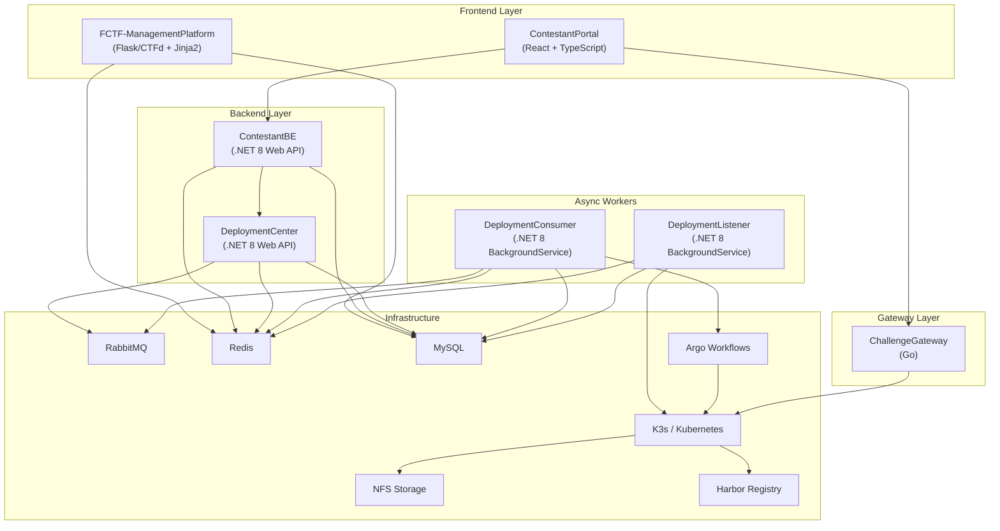
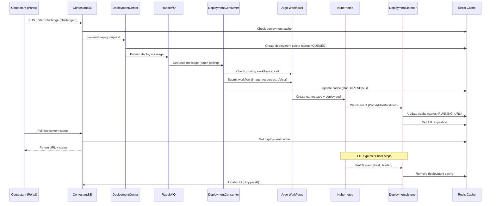

# FCTF Platform — Tài Liệu Hệ Thống Toàn Diện

> **Version**: 0.0.4 | **Repo**: `FCTF-Multiple_Contest` | **Generated**: 2026-04-19

---

## 1. Tổng Quan Dự Án

**FCTF (FPT Capture The Flag)** là một nền tảng CTF (Capture The Flag) dựa trên kiến trúc **microservices**, được thiết kế để vận hành các cuộc thi CTF quy mô lớn với:

- **Challenge deployment động** — mỗi team/session nhận container riêng biệt (isolated runtime)
- **Gateway tập trung** — routing, rate limiting, access control cho challenge instances
- **Portal hiện đại cho thí sinh** — đăng ký, giải bài, nạp flag, xem scoreboard
- **Control Center cho admin** — quản lý challenge, user, hệ thống (fork từ CTFd)
- **Pipeline tự động** — từ request deploy → queue → Argo Workflows → K8s pod → watch status
- **Hạ tầng K3s/Kubernetes** — production-ready với Helm, NFS, Ingress, cert-manager

---

## 2. Kiến Trúc Hệ Thống



---

## 3. Technology Stack Tổng Hợp

| Component | Ngôn Ngữ | Framework / Runtime | Công nghệ chính |
|---|---|---|---|
| **ChallengeGateway** | Go 1.22 | Stdlib (net/http, net) | Redis (rate limiting), TCP+HTTP reverse proxy |
| **ContestantPortal** | TypeScript | React 19 + Vite | MUI v7, TailwindCSS v4, Framer Motion, Recharts, react-router-dom v7 |
| **ContestantBE** | C# | .NET 8 (ASP.NET Core Web API) | EF Core 8 (Pomelo MySQL), Redis cache, JWT, Swagger |
| **DeploymentCenter** | C# | .NET 8 (ASP.NET Core Web API) | RabbitMQ, EF Core, Swagger |
| **DeploymentConsumer** | C# | .NET 8 (BackgroundService) | RabbitMQ, Argo Workflows REST API, Redis |
| **DeploymentListener** | C# | .NET 8 (BackgroundService) | Kubernetes Client (Watch API), Redis, EF Core |
| **ResourceShared** | C# | .NET 8 (Class Library) | K8s Client, RabbitMQ, Redis, JWT, BCrypt, YAML |
| **FCTF-ManagementPlatform** | Python 3 | Flask 2.2 (fork CTFd 3.7.3) | SQLAlchemy, Flask-Migrate, Redis, Gunicorn, Jinja2 |
| **database-migration** | Python 3 | SQLAlchemy 2.0 | PyMySQL, bidirectional FCTF↔CTFd data migration |
| **Documentation** | TypeScript | Docusaurus v4 | MDX, Prism syntax highlighting |
| **FCTF-k3s-manifest** | Bash / YAML | K3s, Helm 3 | Nginx Ingress, NFS, cert-manager, Argo, Harbor, Rancher |
| **Test** | JavaScript | k6 (Grafana) | Load testing, race condition, stress testing |
| **CI/CD** | YAML | GitHub Actions | Build, push to Harbor, deploy via Argo |

---

## 4. Cấu Trúc Thư Mục Chi Tiết

### 4.1 Root Level

```
FCTF-Multiple_Contest/
├── .github/                          # GitHub Actions CI/CD
│   └── workflows/
│       ├── ci-cd.yml                 # Build & deploy pipeline cho tất cả services
│       └── deploy-docs.yml           # Deploy documentation site lên GitHub Pages
├── ChallengeGateway/                 # [Go] Gateway proxy cho challenge instances
├── ContestantPortal/                 # [React/TS] Frontend cho thí sinh
├── ControlCenterAndChallengeHostingServer/  # [.NET 8] Backend monorepo (4 projects)
├── Documentation/                    # [Docusaurus] Website tài liệu
├── FCTF-ManagementPlatform/          # [Python/Flask] Admin platform (fork CTFd)
├── FCTF-k3s-manifest/                # [Bash/YAML] K3s cluster & Helm setup
├── Test/                             # [k6/JS] Test suites
├── database-migration/               # [Python] Tool migrate data FCTF↔CTFd
├── manage.sh                         # Script quản lý cài đặt/gỡ cluster
├── README.MD                         # Hướng dẫn quick start
└── .gitignore
```

---

### 4.2 ChallengeGateway (Go)

> **Mục đích**: Reverse proxy đứng trước các challenge container instances trên K8s, cung cấp rate limiting, token-based access control cho cả HTTP và TCP traffic.

```
ChallengeGateway/
├── main.go                           # Entry point: khởi tạo config, Redis, limiters,
│                                     #   start HTTP server + TCP listener, graceful shutdown
├── go.mod / go.sum                   # Dependencies: go-redis v9, godotenv
├── Dockerfile                        # Multi-stage build
├── .env.example                      # Biến môi trường mẫu
└── internal/
    ├── config/
    │   └── config.go                 # Load env vars (ports, Redis URL, rate limits, backends)
    ├── gateway/
    │   ├── http.go                   # HTTP reverse proxy: path routing, header injection,
    │   │                             #   token validation, request forwarding đến challenge pods
    │   ├── tcp.go                    # TCP reverse proxy: raw socket forwarding cho
    │   │                             #   non-HTTP challenges (pwn, netcat...)
    │   └── util.go                   # Helper functions (IP extraction, header copy...)
    ├── limiter/
    │   ├── limiter.go                # Rate limiter abstraction (per-IP, per-token)
    │   └── redis.go                  # Redis-backed sliding window rate limiter implementation
    └── token/
        └── token.go                  # JWT/HMAC token validation logic
```

**Luồng hoạt động**:
1. Contestant gửi request đến Gateway (HTTP hoặc TCP) kèm token
2. Gateway validate token → extract team_id, challenge_id
3. Kiểm tra rate limit qua Redis
4. Forward request đến đúng pod/service trên K8s cluster
5. Trả response về contestant

---

### 4.3 ContestantPortal (React + TypeScript)

> **Mục đích**: Single Page Application cho thí sinh tham gia cuộc thi — đăng nhập, xem challenges, submit flag, xem scoreboard, quản lý instances.

```
ContestantPortal/
├── index.html                        # HTML entry point
├── package.json                      # Dependencies: React 19, MUI v7, TailwindCSS v4,
│                                     #   Framer Motion, Recharts, react-router-dom v7
├── vite.config.ts                    # Vite bundler config (rolldown-vite)
├── tailwind.config.js                # TailwindCSS config
├── tsconfig*.json                    # TypeScript config
├── docker/                           # Docker build artifacts
├── public/                           # Static assets
└── src/
    ├── main.tsx                      # React DOM entry
    ├── App.tsx                       # Root component: routing, auth check, layout
    ├── index.css                     # Global CSS
    ├── assets/                       # Images, icons
    ├── components/
    │   ├── Layout.tsx                # Main layout: navbar, sidebar, footer
    │   ├── ChallengeCard.tsx         # Card component cho từng challenge
    │   ├── ChartComponent.tsx        # Biểu đồ (Recharts) cho scoreboard
    │   ├── PublicChartComponent.tsx   # Biểu đồ scoreboard công khai
    │   ├── ActionLogs.tsx            # Hiển thị lịch sử hành động
    │   ├── AuthTurnstile.tsx         # Cloudflare Turnstile CAPTCHA integration
    │   ├── PrivateRoute.tsx          # Protected route wrapper
    │   ├── PageLoader.tsx            # Loading skeleton
    │   ├── Skeleton.tsx              # Skeleton placeholders
    │   └── ToastProvider.tsx         # Notification toast (notistack)
    ├── pages/
    │   ├── Login.tsx (+ Login.css)   # Trang đăng nhập
    │   ├── Register.tsx              # Trang đăng ký
    │   ├── Challenges.tsx            # Trang chính: danh sách challenge, filter, submit flag
    │   │                             #   (file lớn nhất ~175KB — nhiều logic inline)
    │   ├── Instances.tsx             # Quản lý challenge instances đang chạy
    │   ├── Scoreboard.tsx            # Bảng xếp hạng
    │   ├── PublicScoreboard.tsx      # Scoreboard công khai (không cần auth)
    │   ├── Profile.tsx               # Trang profile cá nhân
    │   ├── Tickets.tsx               # Hệ thống ticket/hỗ trợ
    │   ├── TicketDetail.tsx          # Chi tiết ticket
    │   └── ActionLogsPage.tsx        # Trang log hành động
    ├── services/
    │   ├── api.ts                    # Axios interceptor, base URL, token injection
    │   ├── authService.ts            # Login, register, token refresh
    │   ├── challengeService.ts       # CRUD challenges, submit flag
    │   ├── challengeTimerService.ts  # Countdown timer cho challenge instances
    │   ├── configService.ts          # App configuration service
    │   ├── envService.ts             # Environment variables
    │   ├── healthCheckService.ts     # Health check gateway/backend
    │   ├── scoreboardService.ts      # Fetch scoreboard data
    │   ├── publicScoreboardService.ts# Public scoreboard API
    │   ├── actionLogService.ts       # Action log API
    │   └── safeSwal.ts              # SweetAlert2 wrapper
    ├── models/                       # TypeScript interfaces
    │   ├── auth.model.ts
    │   ├── user.model.ts
    │   ├── actionLog.model.ts
    │   └── registration.model.ts
    ├── context/
    │   ├── AuthContext.tsx            # Auth state (token, user info)
    │   └── ThemeContext.tsx           # Dark/Light mode
    ├── hooks/
    │   ├── useColors.ts              # Color palette hook
    │   └── useToast.ts               # Toast notification hook
    ├── config/                       # App config constants
    ├── constants/                    # Enum-like constants
    ├── types/                        # Additional TypeScript types
    └── utils/                        # Utility functions
```

---

### 4.4 ControlCenterAndChallengeHostingServer (.NET 8)

> **Mục đích**: Monorepo chứa 4 .NET projects + 1 shared library. Đây là phần **backend core** xử lý toàn bộ logic nghiệp vụ cho thí sinh (auth, challenges, flag submission, scoring) và deployment lifecycle.

```
ControlCenterAndChallengeHostingServer/
├── ControlCenterAndChallengeHosting.sln    # Visual Studio solution file
├── .dockerignore / .gitignore
│
├── ResourceShared/                   # ★ Shared Class Library
│   ├── ResourceShared.csproj         # .NET 8, packages: K8sClient, RabbitMQ, Redis,
│   │                                #   JWT, BCrypt, EF Core (Pomelo MySQL), YAML
│   ├── Models/                       # 32 Entity models (EF Core):
│   │   ├── AppDbContext.cs           # DbContext chính (~50KB), định nghĩa toàn bộ tables
│   │   ├── User.cs                   # User entity
│   │   ├── Team.cs                   # Team entity
│   │   ├── Challenge.cs              # Challenge entity
│   │   ├── Submission.cs             # Flag submission
│   │   ├── Flag.cs                   # Flag definitions
│   │   ├── Hint.cs                   # Challenge hints
│   │   ├── Solf.cs                   # Solves tracking
│   │   ├── Ticket.cs                 # Support tickets
│   │   ├── DeployHistory.cs          # Deploy history
│   │   ├── ChallengeStartTracking.cs # Instance lifecycle tracking
│   │   ├── ArgoOutbox.cs             # Outbox pattern for Argo
│   │   ├── DynamicChallenge.cs       # Dynamic scoring challenge
│   │   ├── MultipleChoiceChallenge.cs# Multiple choice type
│   │   ├── Config.cs                 # System config KV
│   │   └── ... (Award, Badge, Bracket, Comment, Field, File, etc.)
│   ├── DTOs/                         # Data Transfer Objects
│   │   ├── Auth/                     # Login/Register DTOs
│   │   ├── Challenge/                # Challenge-related DTOs
│   │   ├── Deployments/              # Deploy request/response DTOs
│   │   ├── RabbitMQ/                 # Queue message DTOs
│   │   ├── Score/                    # Scoring DTOs
│   │   ├── Submit/                   # Submission DTOs
│   │   ├── Ticket/, Team/, User/, Hint/, File/, Config/, Notification/, Topic/
│   │   └── BaseResponseDTO.cs        # Standard API response wrapper
│   ├── Services/
│   │   └── K8sService.cs             # Kubernetes operations: create/delete namespace,
│   │                                 #   watch pods, handle challenge running state
│   ├── Utils/                        # Redis helper, Challenge helper, JWT utils
│   ├── Enums.cs                      # All system enums (DeploymentStatus, ChallengeType...)
│   ├── Logger/                       # Custom logging infrastructure
│   ├── Middlewares/                   # Shared middleware (auth, error handling)
│   ├── ResponseViews/                # Response view models
│   └── ServiceCollectionExtensions.cs# DI registration helpers
│
├── ContestantBE/                     # ★ Contestant Backend API
│   ├── ContestantBE.csproj           # ASP.NET Core Web API, Swagger, Redis, EF Core
│   ├── Program.cs                    # App startup, DI config, middleware pipeline
│   ├── Dockerfile                    # Build + runtime container
│   ├── Controllers/
│   │   ├── AuthController.cs         # POST /login, /register, /refresh-token
│   │   ├── ChallengeController.cs    # GET challenges, POST submit flag, start/stop instances
│   │   │                             #   (~42KB — heaviest controller, nhiều business logic)
│   │   ├── ScoreboardController.cs   # GET scoreboard, rankings
│   │   ├── HintController.cs         # GET/POST hints, unlock hints
│   │   ├── TicketController.cs       # CRUD support tickets
│   │   ├── ConfigController.cs       # GET app configurations
│   │   ├── FileController.cs         # File download endpoints
│   │   ├── ActionLogsController.cs   # GET action logs
│   │   ├── UsersController.cs        # GET user info
│   │   ├── TeamController.cs         # GET team info
│   │   └── BaseController.cs         # Base controller class
│   ├── Services/
│   │   ├── AuthService.cs            # Authentication logic: login, register, JWT,
│   │   │                             #   ban check, Turnstile CAPTCHA verification (~28KB)
│   │   ├── ChallengeService.cs       # Challenge business logic: list, filter, scoring (~28KB)
│   │   ├── ScoreboardService.cs      # Scoreboard computation
│   │   ├── HintService.cs            # Hint unlock logic, cost deduction (~17KB)
│   │   ├── TicketService.cs          # Ticket management (~11KB)
│   │   ├── FileService.cs            # File serving logic
│   │   ├── ConfigService.cs          # Config retrieval
│   │   ├── ActionLogsServices.cs     # Action log recording
│   │   ├── TeamService.cs            # Team operations
│   │   └── UserContext.cs            # Current user context
│   ├── Filters/                      # Action filters
│   ├── Attribute/                    # Custom attributes
│   ├── RateLimiting/                 # Rate limit policies
│   ├── Utils/                        # Helper utilities
│   └── appsettings.json              # Config (connection strings, JWT settings)
│
├── DeploymentCenter/                 # ★ Deployment API
│   ├── DeploymentCenter.csproj       # ASP.NET Core Web API, RabbitMQ, EF Core
│   ├── Program.cs                    # App startup
│   ├── Dockerfile
│   ├── Controllers/
│   │   ├── ChallengeController.cs    # API cho deploy/stop challenges
│   │   └── StatusCheckController.cs  # Health check / status endpoints
│   ├── Services/
│   │   ├── DeployService.cs          # Core deploy logic: validate, prepare, enqueue (~31KB)
│   │   └── DeploymentProducerService.cs # RabbitMQ producer: publish deploy messages
│   ├── Middlewares/                   # Request middlewares
│   └── Utils/
│
├── DeploymentConsumer/               # ★ Queue Consumer Worker
│   ├── DeploymentConsumer.csproj     # .NET 8 Console/BackgroundService, RabbitMQ, EF Core
│   ├── Program.cs                    # Host builder setup
│   ├── Worker.cs                     # BackgroundService: poll RabbitMQ queue, submit
│   │                                 #   Argo Workflows, update Redis cache
│   ├── DeploymentConsumerConfigHelper.cs  # Config: poll interval, batch size, max workflows
│   ├── Dockerfile
│   ├── Models/                       # Consumer-specific models
│   └── Services/
│       ├── ArgoWorkflowService.cs    # Call Argo REST API to check running workflows
│       └── DeploymentConsumerService.cs  # RabbitMQ dequeue/ack/nack operations
│
└── DeploymentListener/               # ★ K8s Pod Watcher
    ├── DeploymentListener.csproj     # .NET 8 Console/BackgroundService, K8sClient
    ├── Program.cs                    # Host builder setup
    ├── Worker.cs                     # BackgroundService: start pod watcher
    ├── ChallengesInformerService.cs  # Core logic (~16KB):
    │                                 #   - Watch K8s pods via Watch API (label: ctf/kind=challenge)
    │                                 #   - Sharded workers cho concurrent processing
    │                                 #   - Handle pod lifecycle: Added, Modified, Deleted
    │                                 #   - Ghost pod cleanup, crash detection (CrashLoopBackOff)
    │                                 #   - Reconcile orphaned caches khi reconnect
    │                                 #   - Update Redis cache + DB tracking
    ├── DeploymentListenerConfigHelper.cs  # Config (worker count)
    └── Dockerfile
```

---

### 4.5 FCTF-ManagementPlatform (Python/Flask — Fork CTFd)

> **Mục đích**: Admin/Management platform — fork từ CTFd v3.7.3, customized cho FCTF. Dùng để quản lý challenges, users, teams, scoring, và trigger deploy through custom blueprints. **Chỉ cho staff access** (admin, challenge writer, jury).

```
FCTF-ManagementPlatform/
├── Dockerfile                        # Python + gunicorn production build
├── requirements.in / requirements.txt # Flask 2.2, SQLAlchemy 1.4, Redis, Gunicorn, pandas...
├── manage.py                         # Flask management script
├── wsgi.py                           # WSGI entry point
├── serve.py                          # Development server
├── populate.py                       # Seed data script
├── export.py / import.py             # Data export/import utilities
├── ping.py                           # Health check
├── docker-entrypoint.sh              # Container startup script
├── Makefile                          # Build/test commands
├── conf/                             # Nginx/Gunicorn configs
├── migrations/                       # Alembic database migrations
├── CTFd/
│   ├── __init__.py                   # Flask app factory (~430 LOC):
│   │                                 #   - CTFdFlask custom Flask class
│   │                                 #   - Sandboxed Jinja2 environment
│   │                                 #   - Theme loading system (core-beta, admin)
│   │                                 #   - Staff-only access enforcement
│   │                                 #   - Blueprint registration (views, auth, api, events,
│   │                                 #     StartChallenge, DeployHistory, ManageInstance)
│   ├── auth.py                       # Authentication routes
│   ├── views.py                      # Main views
│   ├── config.py / config.ini        # App configuration
│   ├── StartChallenge.py             # ★ Custom: trigger challenge deployment
│   ├── DeployHistory.py              # ★ Custom: view deployment history
│   ├── ManageInstances.py            # ★ Custom: manage running instances
│   ├── SendTicket.py                 # ★ Custom: ticket management
│   ├── admin/
│   │   ├── __init__.py               # Admin blueprint (~19KB)
│   │   ├── challenges.py             # Challenge CRUD admin
│   │   ├── users.py                  # User management admin
│   │   ├── teams.py                  # Team management admin
│   │   ├── scoreboard.py             # Scoreboard admin
│   │   ├── submissions.py            # Submission review
│   │   ├── rewards.py                # Awards/badges admin
│   │   ├── exports.py                # Data export
│   │   ├── instances_history.py      # Instance history viewer
│   │   ├── action_logs.py            # Action log viewer
│   │   ├── admin_audit.py            # Admin audit trail
│   │   ├── statistics.py             # Statistics dashboard
│   │   └── Ticket.py / monitors.py / estimation.py / notifications.py
│   ├── api/
│   │   ├── __init__.py               # Flask-RESTX API setup
│   │   └── v1/
│   │       └── __init__.py           # API v1 endpoints (REST API ~49KB)
│   ├── models/
│   │   └── __init__.py               # SQLAlchemy models (~49KB)
│   ├── schemas/                      # Marshmallow serializers
│   ├── forms/                        # WTForms
│   ├── plugins/                      # CTFd plugin system
│   ├── themes/
│   │   ├── admin/                    # Admin theme (Jinja2 templates)
│   │   └── core-beta/                # Contestant theme (customized)
│   ├── events/                       # Server-Sent Events (SSE) cho real-time
│   ├── cache/                        # Redis caching layer
│   ├── utils/                        # Utility modules
│   ├── constants/                    # Language constants, theme configs
│   ├── translations/                 # i18n (hiện tại chỉ English)
│   ├── cli/                          # CLI commands
│   ├── exceptions/                   # Custom exceptions
│   └── fonts/                        # Font assets
```

---

### 4.6 FCTF-k3s-manifest (Infrastructure)

> **Mục đích**: Toàn bộ scripts và manifests để setup K3s cluster, install FCTF platform, Helm charts, Ingress, Storage, CI/CD, và monitoring.

```
FCTF-k3s-manifest/
├── setup-master.sh                   # Cài K3s server node (master)
├── setup-worker.sh                   # Join worker nodes vào cluster
├── apply-fctf.sh                     # Deploy toàn bộ FCTF lên K8s (~16KB script)
├── setup-harbor.sh                   # Cài Harbor container registry (~9KB)
├── cicd-setup.sh                     # Setup CI/CD (Argo CD/Workflows) (~10KB)
├── configure-domains.sh              # Cấu hình domain/IP cho services
├── nfs-setup.sh                      # Setup NFS storage server
├── rotate-service-passwords.sh       # Rotate credentials (~57KB — comprehensive)
├── README.md                         # Hướng dẫn chi tiết (~24KB)
│
├── docker/                           # Docker Compose cho local dev
│
├── prod/                             # Production Kubernetes manifests
│   ├── app/                          # Application deployments
│   │   ├── contestant-be/            # ContestantBE Deployment + Service
│   │   ├── contestant-portal/        # ContestantPortal Deployment + Service
│   │   ├── challenge-gateway/        # ChallengeGateway Deployment + Service
│   │   ├── deployment-center/        # DeploymentCenter Deployment + Service
│   │   ├── deployment-consumer/      # DeploymentConsumer Deployment
│   │   ├── deployment-listener/      # DeploymentListener Deployment
│   │   ├── admin-mvc/                # ManagementPlatform (CTFd) Deployment
│   │   ├── NetworkPolicy/            # K8s NetworkPolicy rules
│   │   ├── service-clusterip.yaml    # ClusterIP services
│   │   └── service-nodeport.yaml     # NodePort services
│   │
│   ├── helm/                         # Helm value files
│   │   ├── db/                       # MySQL Helm values
│   │   ├── nginx/                    # Nginx Ingress Controller
│   │   ├── registry/                 # Harbor registry
│   │   ├── argo/                     # Argo Workflows Helm
│   │   ├── rancher/                  # Rancher management
│   │   └── monitoring/               # Prometheus/Grafana stack
│   │
│   ├── env/
│   │   ├── configmap/                # Kubernetes ConfigMaps
│   │   └── secret/                   # Kubernetes Secrets
│   │
│   ├── ingress/
│   │   ├── nginx/                    # Nginx Ingress rules
│   │   └── certificate/              # TLS certificates (cert-manager)
│   │
│   ├── storage/
│   │   ├── pv/                       # PersistentVolumes (NFS-backed)
│   │   └── pvc/                      # PersistentVolumeClaims
│   │
│   ├── sa/                           # ServiceAccounts (Argo tokens...)
│   ├── argo-workflows/               # Argo Workflow templates
│   ├── cert-manager/                 # cert-manager setup
│   ├── cron-job/                     # Scheduled K8s jobs
│   ├── ctfd/                         # CTFd-specific K8s configs
│   ├── priority-classes.yaml         # Pod priority classes
│   ├── runtime-class.yaml            # gVisor runtime class
│   ├── helm.sh                       # Helm install script
│   └── db-nodeport.yaml              # Database NodePort (debug)
│
└── uninstall/
    ├── uninstall.sh                  # Uninstall master
    └── uninstall-worker.sh           # Uninstall worker
```

---

### 4.7 database-migration (Python)

> **Mục đích**: Tool CLI để migrate data hai chiều giữa FCTF database và CTFd database. Hỗ trợ chuyển đổi schema qua mapping files JSON.

```
database-migration/
├── main.py                           # CLI menu: chọn hướng migrate, test connections
├── migrator.py                       # Core migration logic (~24KB): đọc source → transform → write target
├── config.py                         # Database connection config
├── mapping_fctf_to_ctfd.json         # Schema mapping: FCTF → CTFd (~10KB)
├── mapping_ctfd_to_fctf.json         # Schema mapping: CTFd → FCTF (~11KB)
├── requirements.txt                  # SQLAlchemy 2.0, PyMySQL, python-dotenv
├── .env.example                      # Connection strings
├── Dockerfile                        # Containerized migration tool
└── docker-compose.yml                # Run with Docker
```

---

### 4.8 Documentation (Docusaurus)

> **Mục đích**: Website tài liệu tĩnh cho FCTF, deploy lên GitHub Pages tại `https://hoaanhtuc113.github.io/FCTF/`.

```
Documentation/
├── docusaurus.config.ts              # Docusaurus v4 config: title, SEO, navbar, search
├── sidebars.ts                       # Sidebar navigation structure
├── package.json                      # Docusaurus dependencies
├── docs/
│   ├── intro.mdx                     # Introduction page
│   ├── architecture/                 # System architecture docs
│   ├── install-and-ops/              # Installation & operations guide
│   ├── product-and-features/         # Feature documentation
│   ├── tutorial-basics/              # Basic usage tutorials
│   └── tutorial-extras/              # Advanced tutorials
├── src/
│   └── css/custom.css                # Custom styling
├── static/                           # Static assets (images, logos)
├── blog/                             # Blog section (disabled)
└── tsconfig.json
```

---

### 4.9 Test (k6 Load Testing)

> **Mục đích**: Bộ test toàn diện sử dụng k6 cho: Gateway testing, Race condition detection, và Stress testing cho tất cả API endpoints.

```
Test/
├── README.md                         # Documentation (~11KB)
│
├── Gateway/                          # ChallengeGateway tests
│   ├── gateway_auth_flow.js          # Auth flow qua gateway
│   ├── gateway_rate_limit.js         # Verify rate limiting
│   ├── gateway_body_limits.js        # Request body size limits
│   ├── gateway_security_negative.js  # Negative security tests
│   ├── gateway_passthrough_load.js   # Load test passthrough
│   ├── gateway_race_under_load.js    # Race condition under load
│   ├── gateway_resilience.js         # Resilience testing
│   ├── gateway_soak.js               # Soak testing (long duration)
│   ├── gateway_spike.js              # Spike traffic testing
│   ├── gateway_integration_extended.js
│   ├── gateway_tcp_auth.ps1          # TCP auth tests (PowerShell)
│   ├── gateway_tcp_limits.ps1        # TCP limits tests
│   ├── gateway_helpers.js            # Shared helper functions
│   ├── generate-gateway-token.ps1/.py# Token generation tools
│   ├── run-gateway-tests.ps1/.sh     # Test runner scripts
│   └── TestCases.md                  # Test case documentation
│
├── RaceCondition/                    # Concurrency/Race condition tests
│   ├── concurrent_correct_submissions.js   # Concurrent flag submissions
│   ├── concurrent_start_challenge.js       # Concurrent challenge starts
│   ├── concurrent_stop_challenge.js        # Concurrent challenge stops
│   ├── concurrent_hint_unlock.js           # Concurrent hint unlocks
│   ├── concurrent_max_attempts.js          # Max attempts race
│   ├── concurrent_cooldown_attempts.js     # Cooldown bypass tests
│   ├── concurrent_dynamic_recalc.js        # Dynamic scoring recalculation
│   ├── helpers.js                          # Shared helpers
│   ├── generate-tokens.ps1                 # Batch token generation
│   ├── run-k6-batch.ps1                    # Batch test runner
│   └── TestCases.md                        # Test case documentation (~26KB)
│
└── Stress/                           # API Stress tests
    ├── all-in-one-stress.js          # Combined stress test
    ├── auth-stress.js                # Auth endpoint stress
    ├── challenge-stress.js           # Challenge API stress
    ├── scoreboard-stress.js          # Scoreboard stress
    ├── hint-stress.js                # Hint API stress
    ├── tickets-stress.js             # Ticket API stress
    ├── team-stress.js                # Team API stress
    ├── users-stress.js               # Users API stress
    ├── config-stress.js              # Config API stress
    ├── actionlogs-stress.js          # Action logs stress
    ├── notifications-stress.js       # Notifications stress
    ├── helpers.js                    # Shared helpers
    ├── run-all-stress.ps1            # Run all stress tests
    ├── run-single-stress.ps1         # Run individual test
    ├── run-with-report.ps1           # Run with HTML report
    ├── run-ci.ps1                    # CI-mode runner
    ├── FILE_STRUCTURE.md             # File structure doc
    ├── QUICKSTART.md                 # Quick start guide
    └── README.md                     # Full documentation (~12KB)
```

---

### 4.10 CI/CD (.github/workflows)

| File | Mục đích |
|---|---|
| `ci-cd.yml` (~11KB) | Pipeline chính: build Docker images cho tất cả services → push lên Harbor registry → trigger Argo CD deploy |
| `deploy-docs.yml` | Build Docusaurus → deploy lên GitHub Pages |

---

## 5. Luồng Hoạt Động Chính (Core Flows)

### 5.1 Challenge Deployment Flow



### 5.2 Flag Submission Flow

```
Contestant → ContestantPortal → ContestantBE
  → Validate token (JWT)
  → Check rate limit
  → Check max attempts
  → Check cooldown
  → Compare flag (case-sensitive / regex)
  → If correct:
      → Record solve
      → Update dynamic scoring
      → Recalculate scoreboard
  → Return result
```

### 5.3 Authentication Flow

```
Contestant → ContestantPortal → ContestantBE
  → POST /login (email, password, turnstile_token)
  → Verify Cloudflare Turnstile CAPTCHA
  → Check user exists + not banned
  → Verify password (BCrypt)
  → Generate JWT token
  → Return token + user info
```

---

## 6. Database Design

Hệ thống sử dụng **MySQL** (qua Pomelo EF Core), chia sẻ database giữa ManagementPlatform (CTFd) và ContestantBE.

### Core Tables (32 entities):

| Category | Tables |
|---|---|
| **Users** | `User`, `Team`, `Token`, `Tracking`, `FieldEntry`, `Field` |
| **Challenges** | `Challenge`, `DynamicChallenge`, `MultipleChoiceChallenge`, `ChallengeTopic`, `Topic`, `Tag` |
| **Competition** | `Submission`, `Solf` (Solves), `Flag`, `Hint`, `Unlock`, `Award`, `AwardBadge`, `Achievement` |
| **Deployment** | `ChallengeStartTracking`, `DeployHistory`, `ArgoOutbox` |
| **System** | `Config`, `Notification`, `Comment`, `ActionLog`, `Bracket`, `File`, `AlembicVersion` |
| **Support** | `Ticket` |

---

## 7. Infrastructure & External Services

| Service | Vai trò | Deployment |
|---|---|---|
| **K3s** | Lightweight Kubernetes distribution | Master + Worker nodes |
| **MySQL** | Main database | Helm chart (prod/helm/db) |
| **Redis** | Cache, session, rate limiting, deployment state | Helm chart |
| **RabbitMQ** | Message queue cho deployment pipeline | Helm chart |
| **Argo Workflows** | Container orchestration cho challenge pods | Helm chart + custom templates |
| **Harbor** | Private container registry | setup-harbor.sh |
| **Nginx Ingress** | TLS termination, routing | Helm chart |
| **cert-manager** | Auto TLS certificate management | Helm chart |
| **NFS** | Persistent storage cho uploads, logs | nfs-setup.sh |
| **Rancher** | K8s cluster management UI (optional) | Helm chart |
| **gVisor** | Sandbox runtime cho challenge containers | runtime-class.yaml |
| **Cloudflare Turnstile** | CAPTCHA cho auth forms | Integrated in ContestantPortal |

---

## 8. Security Features

- **JWT Authentication** — Token-based auth cho ContestantBE APIs
- **Rate Limiting** — Redis-backed, per-IP + per-token (cả Gateway và Backend)
- **gVisor Sandbox** — Challenge pods chạy trong sandboxed runtime
- **Container Hardening** — Resource limits (CPU/Memory), security contexts
- **Network Policies** — K8s NetworkPolicy isolate challenge namespaces
- **CAPTCHA** — Cloudflare Turnstile chống bot
- **Staff-only Admin** — ManagementPlatform chặn tất cả non-staff access
- **HMAC Token Gateway** — Challenge instances chỉ accessible qua signed token
- **Password Hashing** — BCrypt cho user passwords
- **Password Rotation** — Script tự động rotate credentials (~57KB)

---

## 9. Cách Phát Triển (Development Guide)

### Local Development

| Component | Cách chạy |
|---|---|
| **ContestantPortal** | `cd ContestantPortal && npm install && npm run dev` |
| **ContestantBE** | `cd ControlCenterAndChallengeHostingServer/ContestantBE && dotnet run` |
| **DeploymentCenter** | `cd ControlCenterAndChallengeHostingServer/DeploymentCenter && dotnet run` |
| **ChallengeGateway** | `cd ChallengeGateway && go run main.go` |
| **ManagementPlatform** | `cd FCTF-ManagementPlatform && flask run` |
| **Documentation** | `cd Documentation && npm install && npm start` |

### Prerequisites

- **Node.js 18+** — cho ContestantPortal, Documentation
- **.NET 8 SDK** — cho tất cả C# projects
- **Go 1.22+** — cho ChallengeGateway
- **Python 3.10+** — cho ManagementPlatform, database-migration
- **Docker** — cho containerized development
- **MySQL 8+** — database
- **Redis 7+** — cache & rate limiting
- **RabbitMQ 3.12+** — message queue (chỉ cần cho deployment pipeline)

### Cluster Deployment

```bash
# 1. Configure domains
./manage.sh  # → option 9

# 2. Setup master node
./manage.sh  # → option 1

# 3. Setup worker nodes (on each worker)
./manage.sh  # → option 2

# 4. Install FCTF (on master)
./manage.sh  # → option 3

# 5. Setup Harbor (on master)
./manage.sh  # → option 4
```

---

## 10. Tổng Kết

| Metric | Value |
|---|---|
| **Số microservices** | 7 (Gateway, Portal, ContestantBE, DeploymentCenter, DeploymentConsumer, DeploymentListener, ManagementPlatform) |
| **Ngôn ngữ** | 4 (Go, C#, TypeScript, Python) |
| **Database entities** | 32 tables |
| **Test scripts** | 40+ files (k6 load/race/stress) |
| **K8s manifests** | 50+ YAML files |
| **Infra scripts** | 10+ Bash scripts |
| **CI/CD pipelines** | 2 (app deploy + docs deploy) |

> **Kiến trúc tổng thể**: Event-driven microservices trên Kubernetes, sử dụng RabbitMQ cho async deployment pipeline, Redis cho caching/state management, và Argo Workflows cho container orchestration. Thiết kế hướng tới khả năng scale horizontal và isolation mạnh giữa các challenge instances.
