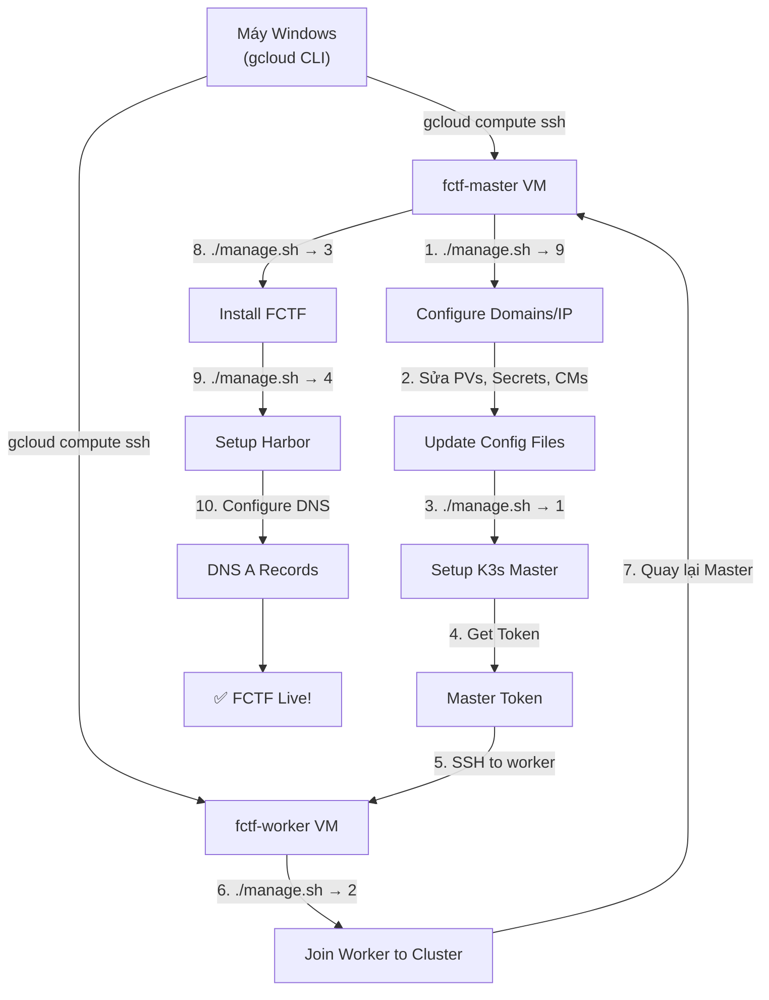

# Hướng Dẫn Deploy FCTF Platform Lên Google Cloud Platform (GCP)

## Mục Lục

1. [Tổng Quan Kiến Trúc](#1-tổng-quan-kiến-trúc)
2. [Prerequisites](#2-prerequisites)
3. [Phase 1: Tạo GCP Project & Cấu Hình Cơ Bản](#3-phase-1)
4. [Phase 2: Tạo VPC Network & Firewall Rules](#4-phase-2)
5. [Phase 3: Tạo VM Instances](#5-phase-3)
6. [Phase 4: Cài Đặt K3s Cluster](#6-phase-4)
7. [Phase 5: Deploy FCTF Platform](#7-phase-5)
8. [Phase 6: Cấu Hình Domain & SSL](#8-phase-6)
9. [Phase 7: Verify & Troubleshoot](#9-phase-7)
10. [Chi Phí Ước Tính & Tối Ưu](#10-chi-phí)
11. [Cleanup / Xóa Tài Nguyên](#11-cleanup)

---

## 1. Tổng Quan Kiến Trúc

```
┌─────────────────────────────────────────────────────────────────┐
│                    Google Cloud Platform                         │
│                                                                 │
│  ┌──────────────────────────────────────────────────────┐       │
│  │              VPC Network: fctf-vpc                    │       │
│  │              Subnet: 10.148.0.0/24                    │       │
│  │                                                       │       │
│  │  ┌─────────────────────┐  ┌─────────────────────┐    │       │
│  │  │   VM1: fctf-master  │  │   VM2: fctf-worker  │    │       │
│  │  │   8 vCPU, 16GB RAM  │  │   8 vCPU, 32GB RAM  │    │       │
│  │  │   200GB SSD         │  │   200GB SSD         │    │       │
│  │  │                     │  │                     │    │       │
│  │  │  • K3s Server       │  │  • K3s Agent        │    │       │
│  │  │  • NFS Server       │  │  • App Workloads    │    │       │
│  │  │  • Calico CNI       │  │  • Challenge Pods   │    │       │
│  │  │  • Ingress Nginx    │  │  • gVisor Sandbox   │    │       │
│  │  │  • Harbor Registry  │  │                     │    │       │
│  │  └─────────────────────┘  └─────────────────────┘    │       │
│  │           │                        │                  │       │
│  │           └────── Private Link ────┘                 │       │
│  │                  10.148.0.x                           │       │
│  └──────────────────────────────────────────────────────┘       │
│                         │                                       │
│              ┌──────────┴──────────┐                            │
│              │   External IP       │                            │
│              │   (Static)          │                            │
│              └──────────┬──────────┘                            │
│                         │                                       │
└─────────────────────────┼───────────────────────────────────────┘
                          │
                    ┌─────┴─────┐
                    │  Internet  │
                    │  Users     │
                    └───────────┘
```

### Yêu Cầu Tài Nguyên

| VM | vCPU | RAM | Disk | Role |
|---|---|---|---|---|
| **fctf-master** | 8 | 16 GB | 200 GB SSD | K3s Server, NFS Server, Harbor |
| **fctf-worker** | 8 | 32 GB | 200 GB SSD | K3s Agent, chạy workloads |

> [!NOTE]
> Nếu muốn tiết kiệm chi phí cho mục đích test/demo, có thể giảm xuống:
> - Master: 4 vCPU / 8 GB RAM / 100 GB SSD
> - Worker: 4 vCPU / 16 GB RAM / 100 GB SSD
> 
> Nhưng sẽ bị giới hạn số challenge có thể deploy đồng thời.

---

## 2. Prerequisites

### Trên máy Windows của bạn

- [ ] **Google Cloud Account** — Đăng ký tại [console.cloud.google.com](https://console.cloud.google.com)
- [ ] **Billing Account** — Cần gắn credit card (GCP free trial cho $300 credit / 90 ngày)
- [ ] **Google Cloud CLI (`gcloud`)** — Cài từ [cloud.google.com/sdk](https://cloud.google.com/sdk/docs/install)

### Cài đặt gcloud CLI trên Windows

```powershell
# Tải và cài Google Cloud SDK installer từ:
# https://cloud.google.com/sdk/docs/install#windows

# Sau khi cài xong, mở PowerShell mới và đăng nhập:
gcloud init

# Chọn:
# 1. Log in (mở browser để đăng nhập Google)
# 2. Chọn hoặc tạo project mới
# 3. Chọn default region (asia-southeast1 cho gần Việt Nam)
```

---

## 3. Phase 1: Tạo GCP Project & Cấu Hình Cơ Bản

### 3.1 Tạo Project

```powershell
# Tạo project mới (tên project phải unique trên toàn GCP)
gcloud projects create fctf-platform --name="FCTF Platform"

# Set project làm default
gcloud config set project fctf-platform

# Gắn billing account
# (Hoặc vào Console > Billing > Link project)
gcloud billing accounts list
gcloud billing projects link fctf-platform --billing-account=YOUR_BILLING_ACCOUNT_ID
```

### 3.2 Enable các API cần thiết

```powershell
gcloud services enable compute.googleapis.com
gcloud services enable dns.googleapis.com
```

### 3.3 Set default region/zone

```powershell
# Chọn region gần Việt Nam (Singapore)
gcloud config set compute/region asia-southeast1
gcloud config set compute/zone asia-southeast1-b
```

> [!TIP]
> **Chọn Region nào?**
> | Region | Vị trí | Latency từ VN |
> |---|---|---|
> | `asia-southeast1` | Singapore | ~30ms ⭐ |
> | `asia-east1` | Taiwan | ~50ms |
> | `asia-northeast1` | Tokyo | ~80ms |
> | `us-central1` | Iowa, US | ~200ms |

---

## 4. Phase 2: Tạo VPC Network & Firewall Rules

### 4.1 Tạo VPC Network

```powershell
# Tạo custom VPC
gcloud compute networks create fctf-vpc `
  --subnet-mode=custom `
  --bgp-routing-mode=regional

# Tạo subnet
gcloud compute networks subnets create fctf-subnet `
  --network=fctf-vpc `
  --region=asia-southeast1 `
  --range=10.148.0.0/24
```

### 4.2 Tạo Firewall Rules

```powershell
# 1) SSH access (từ IP của bạn hoặc 0.0.0.0/0 nếu test)
gcloud compute firewall-rules create fctf-allow-ssh `
  --network=fctf-vpc `
  --allow=tcp:22 `
  --source-ranges=0.0.0.0/0 `
  --target-tags=fctf-node `
  --description="Allow SSH"

# 2) HTTP/HTTPS (cho web truy cập từ internet)
gcloud compute firewall-rules create fctf-allow-http-https `
  --network=fctf-vpc `
  --allow=tcp:80,tcp:443 `
  --source-ranges=0.0.0.0/0 `
  --target-tags=fctf-master `
  --description="Allow HTTP and HTTPS"

# 3) K3s API server (để worker join cluster)
gcloud compute firewall-rules create fctf-allow-k3s-api `
  --network=fctf-vpc `
  --allow=tcp:6443 `
  --source-ranges=10.148.0.0/24 `
  --target-tags=fctf-master `
  --description="Allow K3s API from internal subnet"

# 4) Internal traffic giữa các nodes (Calico VXLAN, NFS, etc.)
gcloud compute firewall-rules create fctf-allow-internal `
  --network=fctf-vpc `
  --allow=tcp:0-65535,udp:0-65535,icmp `
  --source-ranges=10.148.0.0/24 `
  --target-tags=fctf-node `
  --description="Allow all internal traffic between nodes"

# 5) NodePort services (nếu cần truy cập trực tiếp qua NodePort)
gcloud compute firewall-rules create fctf-allow-nodeports `
  --network=fctf-vpc `
  --allow=tcp:30000-32767 `
  --source-ranges=0.0.0.0/0 `
  --target-tags=fctf-master `
  --description="Allow NodePort range"
```

> [!WARNING]
> **Về Security:**
> - SSH rule với `0.0.0.0/0` chỉ nên dùng khi test. Production nên đổi thành IP cụ thể của bạn.
> - Để lấy IP hiện tại: truy cập [whatismyip.com](https://whatismyip.com) rồi thay `0.0.0.0/0` bằng `YOUR_IP/32`.

### 4.3 Reserve Static IP (cho Master)

```powershell
# Tạo Static External IP cho master node
gcloud compute addresses create fctf-master-ip `
  --region=asia-southeast1

# Xem IP đã tạo
gcloud compute addresses describe fctf-master-ip --region=asia-southeast1 --format="get(address)"
```

> Ghi lại IP này — bạn sẽ dùng nó cho TLS SAN và DNS record.

---

## 5. Phase 3: Tạo VM Instances

### 5.1 Tạo Master Node

```powershell
gcloud compute instances create fctf-master `
  --zone=asia-southeast1-b `
  --machine-type=e2-standard-8 `
  --boot-disk-size=200GB `
  --boot-disk-type=pd-ssd `
  --image-family=ubuntu-2204-lts `
  --image-project=ubuntu-os-cloud `
  --network=fctf-vpc `
  --subnet=fctf-subnet `
  --address=fctf-master-ip `
  --tags=fctf-node,fctf-master `
  --metadata=startup-script='#!/bin/bash
    apt update && apt install -y git'
```

### 5.2 Tạo Worker Node

```powershell
gcloud compute instances create fctf-worker `
  --zone=asia-southeast1-b `
  --machine-type=e2-highmem-8 `
  --boot-disk-size=200GB `
  --boot-disk-type=pd-ssd `
  --image-family=ubuntu-2204-lts `
  --image-project=ubuntu-os-cloud `
  --network=fctf-vpc `
  --subnet=fctf-subnet `
  --tags=fctf-node,fctf-worker `
  --metadata=startup-script='#!/bin/bash
    apt update && apt install -y git nfs-common'
```

### 5.3 Verify VMs

```powershell
# Xem danh sách VMs
gcloud compute instances list

# Output sẽ hiển thị dạng:
# NAME          ZONE                  MACHINE_TYPE   INTERNAL_IP   EXTERNAL_IP     STATUS
# fctf-master   asia-southeast1-b     e2-standard-8  10.148.0.2    34.xxx.xxx.xxx  RUNNING
# fctf-worker   asia-southeast1-b     e2-highmem-8   10.148.0.3    35.xxx.xxx.xxx  RUNNING
```

> [!IMPORTANT]
> **Ghi lại các IP này:**
> | VM | Internal IP | External IP |
> |---|---|---|
> | fctf-master | `10.148.0.x` | `34.xxx.xxx.xxx` (static) |
> | fctf-worker | `10.148.0.x` | `35.xxx.xxx.xxx` |
>
> Bạn sẽ cần chúng trong các bước tiếp theo.

### 5.4 Chọn Machine Type phù hợp

| Machine Type | vCPU | RAM | Giá ~USD/tháng | Ghi chú |
|---|---|---|---|---|
| `e2-standard-8` | 8 | 32 GB | ~$195 | Recommended cho master |
| `e2-highmem-8` | 8 | 64 GB | ~$260 | Nếu worker cần RAM lớn |
| `e2-standard-4` | 4 | 16 GB | ~$97 | Budget option cho master |
| `e2-highmem-4` | 4 | 32 GB | ~$130 | Budget option cho worker |
| `n2d-standard-8` | 8 | 32 GB | ~$205 | AMD, hiệu năng tốt hơn |

> [!TIP]
> **Tiết kiệm chi phí:**
> - Dùng **Spot VMs** (thêm `--provisioning-model=SPOT`) → giảm ~60-90% giá, nhưng VM có thể bị thu hồi bất kỳ lúc nào.
> - Dùng **Committed Use Discounts** nếu chạy dài hạn (1 năm → giảm ~37%, 3 năm → giảm ~55%).
> - Dùng `e2-medium` (2 vCPU, 4 GB) cho testing nhanh rồi scale lên sau.

---

## 6. Phase 4: Cài Đặt K3s Cluster

### 6.1 SSH vào Master Node

```powershell
# Từ máy Windows, SSH vào master
gcloud compute ssh fctf-master --zone=asia-southeast1-b
```

> Lần đầu SSH, gcloud sẽ tự tạo SSH key pair. Nhấn Enter khi hỏi passphrase.

### 6.2 Trên Master: Clone repo & Configure

```bash
# Clone FCTF repository
git clone <repo-url> FCTF
cd FCTF
chmod +x manage.sh

# ===== Bước 1: Configure domains/IP =====
./manage.sh
# Chọn: 9) Configure service domains/IP
```

Khi được hỏi, nhập các giá trị:

| Token | Giá trị | Giải thích |
|---|---|---|
| `MASTER_NODE_PRIVATE_IP` | `10.148.0.x` | Internal IP của master (lấy từ `hostname -I`) |
| `RABBITMQ_DOMAIN` | `rabbitmq.fctf.yourdomain.com` | Hoặc dùng `rabbitmq.local` nếu chưa có domain |
| `GRAFANA_DOMAIN` | `grafana.fctf.yourdomain.com` | |
| `CONTESTANT_DOMAIN` | `contest.fctf.yourdomain.com` | Domain chính cho thí sinh |
| `ADMIN_DOMAIN` | `admin.fctf.yourdomain.com` | Domain admin panel |
| `ARGO_DOMAIN` | `argo.fctf.yourdomain.com` | |
| `CONTESTANT_API_DOMAIN` | `api.fctf.yourdomain.com` | API endpoint |
| `REGISTRY_DOMAIN` | `registry.fctf.yourdomain.com` | Harbor registry |
| `RANCHER_DOMAIN` | `rancher.fctf.yourdomain.com` | |
| `GATEWAY_DOMAIN` | `gateway.fctf.yourdomain.com` | Challenge gateway |

> [!TIP]
> **Nếu chưa có domain riêng**, bạn có thể dùng [nip.io](https://nip.io) (free wildcard DNS):
> - `CONTESTANT_DOMAIN` → `contest.34.xxx.xxx.xxx.nip.io`
> - `ADMIN_DOMAIN` → `admin.34.xxx.xxx.xxx.nip.io`
> - ...thay `34.xxx.xxx.xxx` bằng External IP thực của master.
>
> Hoặc dùng `.local` rồi thêm vào file hosts của máy cá nhân.

### 6.3 Trên Master: Cập nhật cấu hình trước khi cài

> [!CAUTION]
> **BẮT BUỘC làm trước khi chạy setup master.** Nếu bỏ qua, services sẽ không kết nối được nhau.

```bash
# --- 1. Cập nhật NFS server IP trong PV files ---
MASTER_INTERNAL_IP=$(hostname -I | awk '{print $1}')

# Sửa tất cả PV files
sed -i "s|server:.*|server: ${MASTER_INTERNAL_IP}|g" \
  FCTF-k3s-manifest/prod/storage/pv/admin-mvc-pv.yaml \
  FCTF-k3s-manifest/prod/storage/pv/contestant-be-pv.yaml \
  FCTF-k3s-manifest/prod/storage/pv/up-challenge-workflow-pv.yaml \
  FCTF-k3s-manifest/prod/storage/pv/start-challenge-workflow-pv.yaml

# --- 2. Cập nhật Secrets (THAY HẾT PASSWORDS MẶC ĐỊNH) ---
# Mở và sửa từng file secret
nano FCTF-k3s-manifest/prod/env/secret/mariadb-auth-secret.yaml
nano FCTF-k3s-manifest/prod/env/secret/redis-auth-secret.yaml
# ... (sửa tất cả files trong thư mục secret/)

# --- 3. Review ConfigMaps (URLs, API endpoints) ---
nano FCTF-k3s-manifest/prod/env/configmap/contestant-be-cm.yaml
nano FCTF-k3s-manifest/prod/env/configmap/challenge-gateway-cm.yaml
# ... (review tất cả files trong thư mục configmap/)
```

### 6.4 Trên Master: Setup K3s Server

```bash
# ===== Bước 2: Setup K3s Master =====
./manage.sh
# Chọn: 1) Setup master

# Khi được hỏi:
#   Master TLS SAN: nhập EXTERNAL IP của master (VD: 34.124.131.240)
#   NFS allowed subnet: nhập 10.148.0.0/24 (private subnet range)
```

Script sẽ tự động:
1. ✅ Update system packages
2. ✅ Configure kernel modules (br_netfilter, overlay)
3. ✅ Disable swap
4. ✅ Setup NFS server tại `/srv/nfs/share`
5. ✅ Install K3s server
6. ✅ Install gVisor (runsc) cho sandbox
7. ✅ Install Calico CNI (VXLAN mode)
8. ✅ Apply RuntimeClass cho gVisor
9. ✅ Taint master node

```bash
# Verify K3s server đang chạy
kubectl get nodes
# NAME               STATUS   ROLES                  AGE   VERSION
# server-1-master    Ready    control-plane,master   1m    v1.xx.x+k3s1

# Lấy master token (cần cho worker join)
./manage.sh
# Chọn: 7) Get master token
# Copy token output
```

### 6.5 SSH vào Worker Node & Join Cluster

```powershell
# Mở terminal MỚI trên Windows, SSH vào worker
gcloud compute ssh fctf-worker --zone=asia-southeast1-b
```

```bash
# Trên worker node
git clone <repo-url> FCTF
cd FCTF
chmod +x manage.sh

# ===== Setup Worker =====
./manage.sh
# Chọn: 2) Setup worker

# Khi được hỏi:
#   Master URL: https://10.148.0.x:6443   (INTERNAL IP của master)
#   Master token: <paste token từ bước trên>
```

### 6.6 Verify Cluster (quay lại Master)

```bash
# SSH về master
kubectl get nodes -o wide
# NAME               STATUS   ROLES                  AGE   VERSION   INTERNAL-IP   
# server-1-master    Ready    control-plane,master   5m    v1.xx     10.148.0.2
# worker-1           Ready    <none>                 1m    v1.xx     10.148.0.3
```

---

## 7. Phase 5: Deploy FCTF Platform

### 7.1 Install FCTF (trên Master)

```bash
# ===== Bước 3: Install FCTF =====
./manage.sh
# Chọn: 3) Install FCTF
```

Script `apply-fctf.sh` sẽ tự động thực hiện:

| Bước | Mô tả | Thời gian ước tính |
|---|---|---|
| 1 | Tạo namespaces (app, db, argo, storage) | ~5s |
| 2 | Apply Secrets & ConfigMaps | ~5s |
| 3 | Apply PVs & PVCs | ~5s |
| 4 | Install Helm (nếu chưa có) | ~30s |
| 5 | Deploy Helm charts (MariaDB, Redis, RabbitMQ, Argo, Nginx, Monitoring) | ~5-10 phút |
| 6 | Deploy 7 app services | ~2 phút |
| 7 | Apply NetworkPolicies | ~5s |
| 8 | Apply Ingress rules | ~5s |
| 9 | Apply CronJobs & Argo templates | ~5s |
| 10 | Bootstrap RabbitMQ users | ~1-2 phút |
| 11 | Init MariaDB schema & grants | ~1 phút |
| 12 | Rotate service passwords | ~2 phút |

### 7.2 Monitor Progress

```bash
# Theo dõi pods đang tạo
watch kubectl get pods -A

# Chờ đến khi TẤT CẢ pods ở trạng thái Running/Completed
# Có thể mất 10-20 phút cho lần đầu (pulling images)
```

Trạng thái mong đợi:

```
NAMESPACE   NAME                                    READY   STATUS
app         admin-mvc-xxx                           1/1     Running
app         contestant-be-xxx                       1/1     Running
app         contestant-portal-xxx                   1/1     Running
app         deployment-center-xxx                   1/1     Running
app         deployment-consumer-xxx                 1/1     Running
app         deployment-listener-xxx                 1/1     Running
app         challenge-gateway-xxx                   1/1     Running
db          mariadb-0                               1/1     Running
db          redis-master-0                          1/1     Running
db          rabbitmq-0                              1/1     Running
argo        argo-workflows-server-xxx               1/1     Running
...
```

### 7.3 Setup Harbor (Optional nhưng Recommended)

```bash
# ===== Bước 4: Setup Harbor =====
./manage.sh
# Chọn: 4) Setup harbor
```

> [!NOTE]
> Harbor dùng để lưu Docker images của challenges. Nếu không cài Harbor, bạn có thể dùng DockerHub hoặc GCR (Google Container Registry) thay thế.

### 7.4 Setup CI/CD (Optional)

```bash
./manage.sh
# Chọn: 5) Setup CI/CD
```

---

## 8. Phase 6: Cấu Hình Domain & SSL

### Option A: Dùng Domain Riêng (Recommended cho Production)

#### 8.1 Mua/Sử dụng domain có sẵn

Bạn cần trỏ DNS records về External IP của master node.

#### 8.2 Cấu hình DNS Records

Vào DNS provider của bạn (Cloudflare, Google Domains, Namecheap, etc.) và tạo các **A Records**:

| Type | Name | Value | TTL |
|---|---|---|---|
| A | `contest.fctf` | `34.xxx.xxx.xxx` (Master External IP) | 300 |
| A | `admin.fctf` | `34.xxx.xxx.xxx` | 300 |
| A | `api.fctf` | `34.xxx.xxx.xxx` | 300 |
| A | `gateway.fctf` | `34.xxx.xxx.xxx` | 300 |
| A | `argo.fctf` | `34.xxx.xxx.xxx` | 300 |
| A | `grafana.fctf` | `34.xxx.xxx.xxx` | 300 |
| A | `rabbitmq.fctf` | `34.xxx.xxx.xxx` | 300 |
| A | `registry.fctf` | `34.xxx.xxx.xxx` | 300 |
| A | `rancher.fctf` | `34.xxx.xxx.xxx` | 300 |

> Thay `fctf` bằng domain thực của bạn, VD: `contest.fctf.example.com`

#### 8.3 SSL Certificates (tự động qua cert-manager)

Project đã cấu hình **cert-manager** + **Let's Encrypt**. Sau khi DNS trỏ đúng, certificates sẽ được tạo tự động.

```bash
# Verify certificates
kubectl get certificates -A
kubectl get certificaterequests -A

# Xem trạng thái
kubectl describe certificate -n app <certificate-name>
```

### Option B: Dùng nip.io (Nhanh, cho Test/Demo)

Không cần mua domain. Dùng wildcard DNS service miễn phí.

```bash
# Ví dụ: Master External IP = 34.124.131.240
# Các domain sẽ tự động resolve:
# contest.34.124.131.240.nip.io  → 34.124.131.240
# admin.34.124.131.240.nip.io    → 34.124.131.240
```

> [!WARNING]
> nip.io **KHÔNG hỗ trợ SSL/HTTPS** qua Let's Encrypt (vì không thể verify domain ownership).
> Chỉ dùng HTTP cho testing.

### Option C: Dùng Google Cloud DNS (Managed DNS)

```powershell
# Tạo DNS zone trên GCP
gcloud dns managed-zones create fctf-zone `
  --dns-name="fctf.yourdomain.com." `
  --description="FCTF Platform DNS"

# Thêm A records
gcloud dns record-sets create contest.fctf.yourdomain.com. `
  --zone=fctf-zone `
  --type=A `
  --ttl=300 `
  --rrdatas=34.xxx.xxx.xxx

# Lặp lại cho các subdomain khác...

# Lấy nameservers → cập nhật ở domain registrar
gcloud dns managed-zones describe fctf-zone --format="get(nameServers)"
```

---

## 9. Phase 7: Verify & Troubleshoot

### 9.1 Kiểm tra toàn bộ hệ thống

```bash
# 1. Nodes
kubectl get nodes -o wide

# 2. Tất cả Pods
kubectl get pods -A

# 3. Services
kubectl get svc -A

# 4. Ingress
kubectl get ingress -A

# 5. PV/PVC
kubectl get pv,pvc -A

# 6. Events (xem lỗi gần đây)
kubectl get events -A --sort-by='.lastTimestamp' | tail -20
```

### 9.2 Truy cập Service (nếu chưa có domain)

```bash
# Port-forward từ master
kubectl port-forward -n app svc/contestant-portal 8080:80 --address=0.0.0.0 &
kubectl port-forward -n app svc/contestant-be 5000:80 --address=0.0.0.0 &
kubectl port-forward -n app svc/admin-mvc 4000:8000 --address=0.0.0.0 &

# Truy cập từ browser:
# http://MASTER_EXTERNAL_IP:8080  → Contestant Portal
# http://MASTER_EXTERNAL_IP:5000  → API
# http://MASTER_EXTERNAL_IP:4000  → Admin Panel
```

> Nhớ thêm firewall rule cho port 8080, 5000, 4000 nếu port-forward:
> ```powershell
> gcloud compute firewall-rules create fctf-allow-portforward `
>   --network=fctf-vpc `
>   --allow=tcp:4000,tcp:5000,tcp:8080 `
>   --source-ranges=0.0.0.0/0 `
>   --target-tags=fctf-master
> ```

### 9.3 Troubleshooting phổ biến

#### Pod ở trạng thái `Pending`

```bash
# Xem lý do
kubectl describe pod <pod-name> -n <namespace>

# Nguyên nhân phổ biến:
# 1. Insufficient resources → scale machine type
# 2. No nodes available → kiểm tra taint/toleration
# 3. PVC pending → kiểm tra NFS server
```

#### Pod ở trạng thái `CrashLoopBackOff`

```bash
# Xem logs
kubectl logs <pod-name> -n <namespace> --previous

# Nguyên nhân phổ biến:
# 1. Sai connection string → kiểm tra ConfigMaps/Secrets
# 2. DB chưa ready → chờ MariaDB pod chạy trước
# 3. Image pull error → kiểm tra image name và registry access
```

#### Không kết nối được giữa services

```bash
# Test DNS từ trong cluster
kubectl run -it --rm debug --image=busybox -- nslookup mariadb.db.svc.cluster.local

# Kiểm tra NetworkPolicy
kubectl get networkpolicy -A

# Kiểm tra Calico
kubectl get pods -n kube-system | grep calico
```

#### NFS mount thất bại

```bash
# Trên master, kiểm tra NFS server
sudo exportfs -v
sudo systemctl status nfs-kernel-server

# Trên worker, test mount
sudo mount -t nfs MASTER_INTERNAL_IP:/srv/nfs/share /mnt
ls /mnt
sudo umount /mnt
```

---

## 10. Chi Phí Ước Tính & Tối Ưu

### Chi phí hàng tháng (ước tính, region asia-southeast1)

| Tài nguyên | Spec | Chi phí/tháng (USD) |
|---|---|---|
| VM Master | e2-standard-8 (8 vCPU, 32GB) | ~$195 |
| VM Worker | e2-highmem-8 (8 vCPU, 64GB) | ~$260 |
| Disk Master | 200GB SSD | ~$34 |
| Disk Worker | 200GB SSD | ~$34 |
| Static IP | 1 IP | ~$7 |
| Network Egress | ~50GB/tháng | ~$6 |
| **Tổng** | | **~$536/tháng** |

### Cách tiết kiệm

| Phương pháp | Tiết kiệm | Ghi chú |
|---|---|---|
| Dùng `e2-standard-4` cho cả 2 VM | ~50% | Đủ cho test/demo nhỏ |
| Dùng **Spot VMs** | ~60-90% | VM có thể bị thu hồi |
| **Committed Use** (1 năm) | ~37% | Cam kết sử dụng |
| Tắt VM khi không dùng | Varies | `gcloud compute instances stop` |
| Dùng **Standard Disk** thay SSD | ~40% disk | I/O chậm hơn |

### Tắt/Bật VMs để tiết kiệm

```powershell
# Tắt khi không dùng (KHÔNG mất data)
gcloud compute instances stop fctf-master fctf-worker --zone=asia-southeast1-b

# Bật lại khi cần
gcloud compute instances start fctf-master fctf-worker --zone=asia-southeast1-b

# Sau khi bật lại, SSH vào master và kiểm tra:
# K3s sẽ tự khởi động lại, nhưng có thể cần 2-3 phút để tất cả pods healthy
```

> [!IMPORTANT]
> Khi stop VM, bạn **KHÔNG bị tính tiền VM** (chỉ tính tiền disk và static IP).
> Đây là cách hiệu quả nhất để tiết kiệm khi chỉ dùng vài giờ/ngày.

---

## 11. Cleanup / Xóa Tài Nguyên

Khi không cần nữa, **XÓA HẾT** để tránh bị charge:

```powershell
# 1. Xóa VMs
gcloud compute instances delete fctf-master fctf-worker `
  --zone=asia-southeast1-b --quiet

# 2. Xóa Static IP
gcloud compute addresses delete fctf-master-ip `
  --region=asia-southeast1 --quiet

# 3. Xóa Firewall rules
gcloud compute firewall-rules delete `
  fctf-allow-ssh `
  fctf-allow-http-https `
  fctf-allow-k3s-api `
  fctf-allow-internal `
  fctf-allow-nodeports --quiet

# 4. Xóa Subnet & VPC
gcloud compute networks subnets delete fctf-subnet `
  --region=asia-southeast1 --quiet
gcloud compute networks delete fctf-vpc --quiet

# 5. (Optional) Xóa DNS zone
gcloud dns managed-zones delete fctf-zone --quiet

# 6. Verify không còn tài nguyên nào
gcloud compute instances list
gcloud compute addresses list
gcloud compute firewall-rules list --filter="network:fctf-vpc"
```

> [!CAUTION]
> **Xóa VM sẽ xóa luôn disk và toàn bộ data.** Nếu muốn giữ data, hãy tạo snapshot trước:
> ```powershell
> gcloud compute disks snapshot fctf-master `
>   --zone=asia-southeast1-b `
>   --snapshot-names=fctf-master-backup
> ```

---

## Quick Reference: Luồng Lệnh Tổng Hợp



### Checklist nhanh

- [ ] Tạo GCP project + enable APIs
- [ ] Tạo VPC + Firewall rules
- [ ] Reserve Static IP
- [ ] Tạo Master VM + Worker VM
- [ ] SSH Master → Clone repo
- [ ] `./manage.sh → 9` (Configure domains)
- [ ] Sửa PV files (NFS server IP)
- [ ] Sửa Secrets (passwords)
- [ ] Review ConfigMaps (URLs)
- [ ] `./manage.sh → 1` (Setup master)
- [ ] SSH Worker → Clone repo
- [ ] `./manage.sh → 2` (Join cluster)
- [ ] Quay lại Master → `./manage.sh → 3` (Install FCTF)
- [ ] `./manage.sh → 4` (Setup Harbor)
- [ ] Cấu hình DNS records
- [ ] Verify tất cả pods Running
- [ ] Test truy cập web
